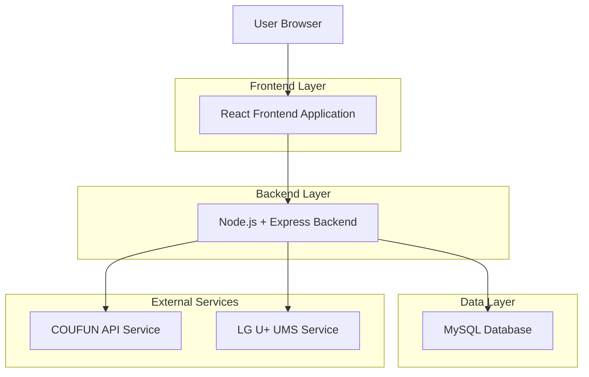
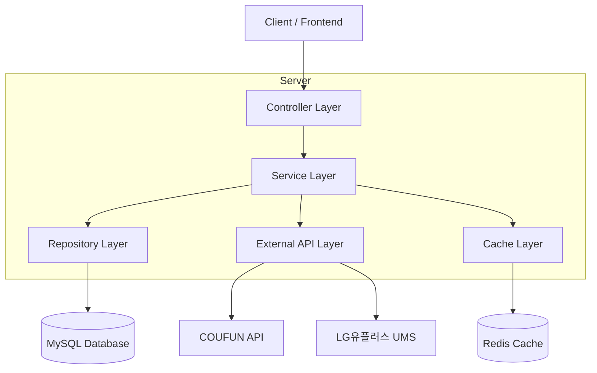
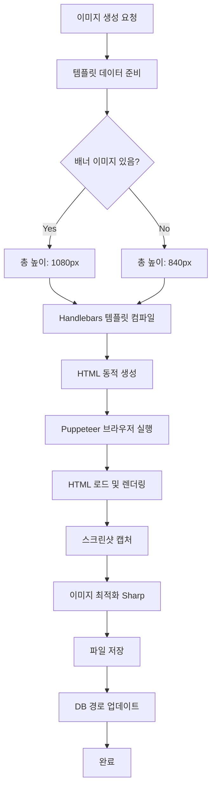
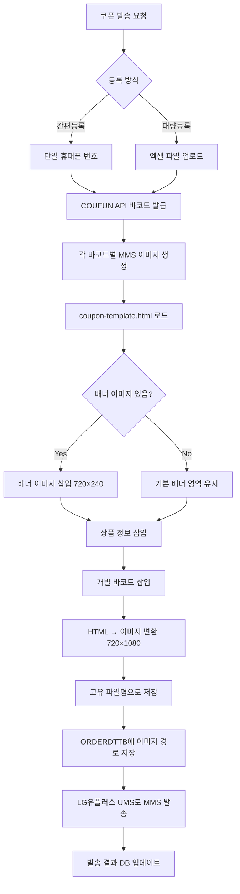
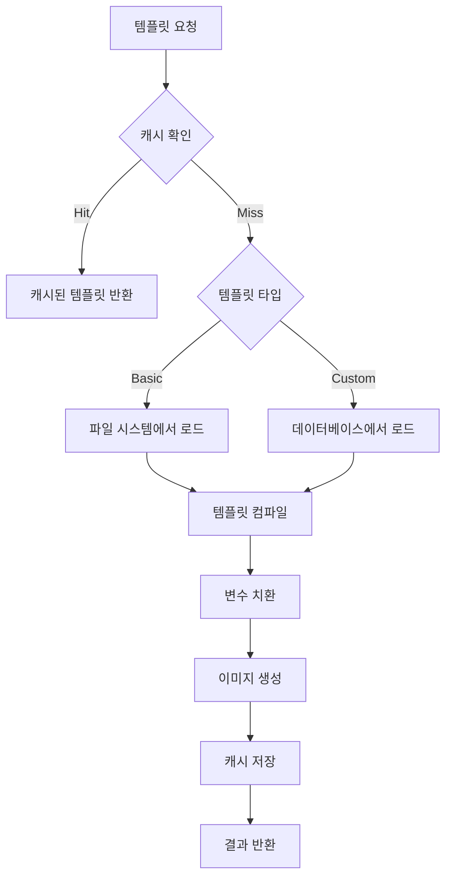

# 모바일 쿠폰 시스템 기술 아키텍처 문서

## 1. Architecture design



## 2. Technology Description

* **Frontend**: 기존 HTML/CSS/JavaScript (Bootstrap 5 + Font Awesome + Flatpickr)

* **Backend**: Node.js\@18 + Express\@4 + TypeScript

* **Database**: MySQL\@8.0 (Primary), Redis\@7 (Cache)

* **External APIs**: COUFUN B2C API, LG유플러스 UMS 시스템

* **MMS 이미지 생성**: Puppeteer\@21 (HTML to Image), Sharp\@0.33 (이미지 처리), Multer\@1.4 (파일 업로드)

## 3. Route definitions

| Route                             | Purpose                |
| --------------------------------- | ---------------------- |
| /api/auth/login                   | 사용자 로그인 인증 및 JWT 토큰 발급 |
| /api/auth/logout                  | 로그아웃 처리 및 세션 무효화       |
| /api/auth/verify                  | JWT 토큰 유효성 검증          |
| /api/products                     | COUFUN 상품 정보 조회 및 캐싱   |
| /api/coupons/create               | 쿠폰 생성 및 MMS 발송 처리      |
| /api/coupons/status               | 쿠폰 상태 조회 및 잔액 확인       |
| /api/coupons/cancel               | 쿠폰 취소 처리               |
| /api/dispatch/history             | 발송 이력 조회 및 검색          |
| /api/dispatch/detail              | 발송 상세 정보 조회            |
| /api/dispatch/export              | 발송 결과 엑셀 다운로드          |
| /api/cs/search                    | C/S 쿠폰 검색              |
| /api/cs/phone-change              | 휴대폰 번호 변경 처리           |
| /api/cs/resend                    | 쿠폰 재발송 처리              |
| /api/webhook/coufun/exchange-info | COUFUN 교환정보 실시간 수신 웹훅  |

## 4. API definitions

### 4.1 Core API

**사용자 인증 관련**

```
POST /api/auth/login
```

Request:

| Param Name | Param Type | isRequired | Description |
| ---------- | ---------- | ---------- | ----------- |
| user_id   | string     | true       | 사용자 ID      |
| password   | string     | true       | 비밀번호        |

Response:

| Param Name | Param Type | Description |
| ---------- | ---------- | ----------- |
| success    | boolean    | 로그인 성공 여부   |
| token      | string     | JWT 토큰      |
| user       | object     | 사용자 정보      |

**상품 조회 관련**

```
GET /api/products
GET /api/products/:goods_id
```

**쿠폰 발송 관련**

```
POST /api/coupons/create
POST /api/coupons/bulk-create
```

Request:

| Param Name | Param Type | isRequired | Description                                                                              |
| ---------- | ---------- | ---------- | ---------------------------------------------------------------------------------------- |
| tr_id     | string     | true       | 우리 시스템 고유 트랜잭션 ID (형식: datetime14자리+innobeat+순차번호8자리, 예: 20241201120000innobeatb2b00001) |

**발송 조회 관련**

```
GET /api/orders
GET /api/orders/:order_id
GET /api/orders/:order_id/details
```

**C/S 처리 관련**

```
POST /api/cs/phone-change
POST /api/cs/resend
POST /api/cs/cancel
GET /api/cs/history/:barcode_num
```

**COUFUN 연동 관련**

```
GET /api/coufun/products
POST /api/coufun/create-coupon
POST /api/coufun/coupon-status
POST /api/coufun/cancel-coupon
```

Request (상품정보 조회):
| Param Name | Param Type | isRequired | Description |
| ---------- | ---------- | ---------- | ----------- |
| POC_ID | string | true | 고객사 ID (10byte) |

Response (상품정보):
| Param Name | Param Type | Description |
| ---------- | ---------- | ----------- |
| RESULT_CODE | string | 실행 결과 코드 (00:성공, 01~99:오류) |
| RESULT_MSG | string | 실행 결과 메시지 |
| LIST_CNT | number | 상품 목록 개수 |
| GOODS_ID | string | 상품 ID |
| GOODS_NAME | string | 상품명 |
| GOODS_ORI_PRICE | number | 상품 정가 |
| GOODS_PRICE | number | 상품 공급가 |
| IMAGE_PATH_S | string | 상품 이미지 (소형) |
| IMAGE_PATH_M | string | 상품 이미지 (중형) |
| IMAGE_PATH_B | string | 상품 이미지 (대형) |

Request (쿠폰생성):
| Param Name | Param Type | isRequired | Description |
| ---------- | ---------- | ---------- | ----------- |
| POC_ID | string | true | 고객사 ID (10byte) |
| GOODS_ID | string | true | 판매상품 ID (10byte) |
| CREATE_CNT | number | true | 쿠폰 생성 개수 (최대 10개) |
| TR_ID | string | false | 고객사 고유 ID (50byte) |

Response (쿠폰생성):
| Param Name | Param Type | Description |
| ---------- | ---------- | ----------- |
| RESULT_CODE | string | 실행 결과 코드 |
| RESULT_MSG | string | 실행 결과 메시지 |
| ORDER_ID | string | 주문 ID |
| BARCODE_NUM | string | 쿠폰번호 (30byte) |
| VALID_END_DATE | string | 유효기간 (YYYYMMDD) |

Request (쿠폰상태조회):
| Param Name | Param Type | isRequired | Description |
| ---------- | ---------- | ---------- | ----------- |
| POC_ID | string | true | 고객사 ID (10byte) |
| GOODS_ID | string | true | 판매상품 ID (10byte) |
| BARCODE_NUM | string | true | 쿠폰번호 (30byte) |

Response (쿠폰상태조회):
| Param Name | Param Type | Description |
| ---------- | ---------- | ----------- |
| RESULT_CODE | string | 실행 결과 코드 |
| COUPON_TYPE | string | 쿠폰타입 (BARCODE:교환권, AMOUNT:금액권) |
| STATUS | string | 쿠폰 상태 (000:미사용, 001:사용, 100:취소) |
| TOTAL_AMOUNT | string | 총 금액 (금액권일 때) |
| REMAIN_AMOUNT | string | 남은 금액 (금액권일 때) |

**LG U+ UMS 연동 관련**

```
POST /api/ums/send-mms
GET /api/ums/result/:client_key
```

Request (MMS 발송):
| Param Name | Param Type | isRequired | Description |
| ---------- | ---------- | ---------- | ----------- |
| CLIENT_KEY | string | true | 메시지 고유 번호 (40byte, 우리 tr_id 사용) |
| REQ_CH | string | true | 발송 채널 (MMS) |
| TRAFFIC_TYPE | string | false | 메시지 유형 (normal/real/batch) |
| CALLBACK_NUMBER | string | true | 발신번호 (16byte) |
| PHONE | string | true | 수신번호 (16byte) |
| MSG | string | true | 메시지 내용 (2000byte) |
| TITLE | string | false | 제목 (100byte) |
| MMS_FILE_LIST | string | false | MMS 파일 (최대 3개, 쉼표 구분) |

Response (발송결과):
| Param Name | Param Type | Description |
| ---------- | ---------- | ----------- |
| DONE_CODE | string | 처리 결과 코드 (00000:성공) |
| DONE_PRODUCT | string | 발송 성공 상품 (MMS) |
| DONE_DATE | datetime | 단말 전달 시간 |
| DONE_TELCO | string | 이통사 코드 |

> **참고**: 
> - COUFUN API는 XML 형식으로 응답하며, 모든 URL은 HTTPS 사용
> - LG유플러스 UMS는 UMS_MSG 테이블 INSERT 방식으로 발송
> - 발송 결과는 UMS_LOG_YYYYMM 테이블에서 확인

**MMS 이미지 생성 관련**

```
POST /api/mms/generate-images
GET /api/mms/images/:tr_id
DELETE /api/mms/images/:tr_id
POST /api/mms/upload-banner
```

Request (이미지 생성):

| Param Name | Param Type | isRequired | Description |
| ---------- | ---------- | ---------- | ----------- |
| order_hd_id | number | true | 주문 헤더 ID |
| tr_ids | array | true | 생성할 tr_id 배열 |
| banner_image_path | string | false | 배너 이미지 경로 (옵션) |

Response:

| Param Name | Param Type | Description |
| ---------- | ---------- | ----------- |
| success | boolean | 생성 성공 여부 |
| generated_count | number | 생성된 이미지 수 |
| failed_count | number | 실패한 이미지 수 |
| image_paths | array | 생성된 이미지 경로 배열 |

**템플릿 관리 관련**

```
GET /api/templates
GET /api/templates/:template_id
POST /api/templates
PUT /api/templates/:template_id
DELETE /api/templates/:template_id
POST /api/templates/:template_id/activate
GET /api/templates/:template_id/preview
```

**웹훅 API**

```
POST /api/webhook/coufun/exchange-info
```

Request (COUFUN에서 실시간 교환정보 수신):

| Param Name     | Param Type | isRequired | Description             |
| -------------- | ---------- | ---------- | ----------------------- |
| BARCODE_NUM   | string     | true       | 쿠폰번호 (30byte)                    |
| EXCHANGE_NUM  | string     | false      | 사용/사용취소 인증번호 (30byte)                 |
| STATUS         | string     | true       | 쿠폰 상태 (000:미사용, 001:사용, 100:취소) |
| EXCHANGE_DATE | string     | false      | 사용/취소 시간 (YYYYMMDDHH24MISS) |
| BRANCH_NAME   | string     | false      | 사용/취소된 지점명 (50byte)                     |
| BRANCH_CODE   | string     | false      | 사용/취소된 지점코드 (20byte)                    |
| BARCODE_TYPE  | string     | false      | 쿠폰 종류 (BARCODE:교환권, AMOUNT:금액권) |
| PRICE          | string     | false      | 쿠폰 금액 (BARCODE:공급가, AMOUNT:사용된 금액) |
| BALANCE        | string     | false      | 잔액 (BARCODE:0, AMOUNT:잔액) |

Response:

| Param Name | Param Type | Description  |
| ---------- | ---------- | ------------ |
| RESULTCODE | string     | 00:처리완료, 01:등록IP오류, 03:쿠폰번호오류, 04:중복오류, 99:기타오류 |
| RESULTMSG  | string     | 처리 결과 메시지 (영문으로 응답, 예: Success)    |
| EXCHANGE_ID | string   | 요청에 대한 처리 ID (50byte) |

Example:

```json
{
  "BARCODE_NUM": "1234567890123456789",
  "EXCHANGE_NUM": "EXC20241201001",
  "STATUS": "001",
  "EXCHANGE_DATE": "20241201120000",
  "BRANCH_NAME": "강남점",
  "BRANCH_CODE": "BR001",
  "BARCODE_TYPE": "BARCODE",
  "PRICE": "10000",
  "BALANCE": "0"
}
```

> **참고**: 
> - COUFUN에서 '00' 코드 미수신 시 10분 간격으로 재시도
> - 중복 요청 수신 시 '00' 또는 '04' 코드로 응답 필요
> - 응답 결과는 로그 형태로 반드시 관리

## 5. Server architecture diagram



## 6. Data model

### 6.1 Data model definition

```mermaid
erDiagram
    USERS ||--o{ ORDERHDTB : creates
    USERS ||--o{ ORDERDTTB : creates
    USERS ||--o{ CS_HISTORY : creates
    PRODUCTS ||--o{ ORDERHDTB : contains
    PRODUCTS ||--o{ ORDERDTTB : contains
    ORDERHDTB ||--o{ ORDERDTTB : contains
    ORDERDTTB ||--o{ CS_HISTORY : processes

    USERS {
        int id PK
        varchar user_id UK
        varchar password_hash
        varchar name
        varchar email
        enum role
        int created_by FK
        timestamp created_at
        int updated_by FK
        timestamp updated_at
    }
    
    PRODUCTS {
        varchar goods_id PK
        varchar cat_id
        varchar goods_name
        int goods_ori_price
        int goods_price
        text goods_info
        text use_guide
        varchar exc_branch
        char valid_end_type
        varchar valid_end_date
        char send_type
        varchar image_path_s
        varchar image_path_m
        varchar image_path_b
        timestamp cached_at
        int created_by FK
        timestamp created_at
        int updated_by FK
        timestamp updated_at
    }
    
    ORDERHDTB {
        int id PK
        varchar order_id UK
        varchar client_name
        varchar sales_manager
        varchar client_requester
        varchar requester_phone
        varchar requester_email
        varchar event_name
        datetime dispatch_datetime
        varchar goods_id FK
        varchar goods_name
        varchar valid_end_date
        int goods_ori_price
        int goods_price
        varchar exc_branch
        varchar mms_title
        varchar mms_content
        varchar sender_phone
        varchar banner_image_path
        int total_quantity
        int unit_price
        int total_price
        enum status
        int created_by FK
        timestamp created_at
        int updated_by FK
        timestamp updated_at
    }
    
    ORDERDTTB {
        int id PK "AUTO_INCREMENT"
        int order_hd_id FK "주문 헤더 ID"
        varchar tr_id UK "우리 시스템 고유 트랜잭션 ID (COUFUN TR_ID, LG유플러스 CLIENT_KEY로 공통 사용)"
        varchar barcode_num UK "COUFUN 쿠폰번호"
        varchar recipient_phone "수신자 휴대폰번호"
        enum registration_type "등록 방식"
        varchar goods_id FK "상품 ID"
        varchar goods_name "상품명"
        varchar valid_end_date "유효기간 (YYYYMMDD)"
        int goods_ori_price "원가"
        int goods_price "판매가"
        varchar exc_branch "교환 가능 지점"
        enum coupon_status "쿠폰 상태 (000:미사용, 001:사용, 100:취소/폐기)"
        varchar mms_result_code "LG유플러스 발송 결과코드 (10000:발송성공, 그외:발송실패)"
        varchar mms_result_desc "LG유플러스 결과 상세"
        varchar mms_image_path "MMS 이미지 파일 경로"
        datetime sent_at "MMS 발송일시"
        datetime delivered_at "MMS 전달일시"
        int cs_resend_count "재발송 횟수"
        int cs_phone_change_count "번호변경 횟수"
        varchar parent_tr_id "번호변경 시 원본 tr_id"
        boolean is_expired "유효기간 만료 여부"
        varchar exchange_date "교환일자"
        varchar branch_name "교환 지점명"
        varchar branch_code "교환 지점코드"
        varchar exchange_num "교환번호"
        int created_by FK "생성자 ID"
        timestamp created_at "생성일시"
        int updated_by FK "수정자 ID"
        timestamp updated_at "수정일시"
    }
    
    CS_HISTORY {
        int id PK
        int order_dt_id FK
        varchar barcode_num
        enum action_type
        varchar old_phone
        varchar new_phone
        text reason
        text result_message
        enum status
        varchar event_name "이벤트명"
        varchar goods_id "상품 ID"
        varchar goods_name "상품명"
        varchar valid_end_date "유효기간 (YYYYMMDD)"
        varchar exc_branch "교환 가능 지점"
        varchar mms_result_code "LG유플러스 발송 결과코드"
        varchar mms_result_desc "LG유플러스 결과 상세"
        datetime sent_at "MMS 발송일시"
        datetime delivered_at "MMS 전달일시"
        int created_by FK
        timestamp created_at
        int updated_by FK
        timestamp updated_at
    }
```



### 6.2 Data Definition Language

**사용자 테이블 (users)**

```sql
-- create table
CREATE TABLE users (
    id INT PRIMARY KEY AUTO_INCREMENT,
    user_id VARCHAR(50) UNIQUE NOT NULL COMMENT '사용자 로그인 ID',
    password_hash VARCHAR(255) NOT NULL COMMENT '암호화된 비밀번호',
    name VARCHAR(100) NOT NULL COMMENT '사용자 실명',
    email VARCHAR(255) NOT NULL COMMENT '이메일 주소',
    role ENUM('admin', 'user') DEFAULT 'user' COMMENT '사용자 권한',
    created_by INT DEFAULT 1 COMMENT '생성자 ID (users.id 참조)',
    created_at TIMESTAMP DEFAULT CURRENT_TIMESTAMP COMMENT '생성일시',
    updated_by INT DEFAULT 1 COMMENT '수정자 ID (users.id 참조)',
    updated_at TIMESTAMP DEFAULT CURRENT_TIMESTAMP ON UPDATE CURRENT_TIMESTAMP COMMENT '수정일시'
);

-- create index
CREATE INDEX idx_users_user_id ON users(user_id);
CREATE INDEX idx_users_email ON users(email);
CREATE INDEX idx_users_created_by ON users(created_by);
CREATE INDEX idx_users_updated_by ON users(updated_by);

-- init data
INSERT INTO users (user_id, password_hash, name, email, role, created_by, updated_by) VALUES
('admin', '$2b$10$hash_value_here', '시스템관리자', 'admin@company.com', 'admin', 1, 1),
('user1', '$2b$10$hash_value_here', '홍길동', 'user1@company.com', 'user', 1, 1);
```

**상품 정보 테이블 (products)**

```sql
-- create table
CREATE TABLE products (
    goods_id VARCHAR(10) PRIMARY KEY COMMENT '상품 ID',
    cat_id VARCHAR(10) COMMENT '카테고리 ID',
    goods_name VARCHAR(150) NOT NULL COMMENT '상품명',
    goods_ori_price INT NOT NULL COMMENT '원가',
    goods_price INT NOT NULL COMMENT '판매가',
    goods_info TEXT COMMENT '상품 설명',
    use_guide TEXT COMMENT '사용 안내',
    exc_branch VARCHAR(50) COMMENT '교환 가능 지점',
    valid_end_type CHAR(1) COMMENT '유효기간 타입',
    valid_end_date VARCHAR(8) COMMENT '유효기간',
    send_type CHAR(1) COMMENT '발송 타입',
    image_path_s VARCHAR(150) COMMENT '소형 이미지 경로',
    image_path_m VARCHAR(150) COMMENT '중형 이미지 경로',
    image_path_b VARCHAR(150) COMMENT '대형 이미지 경로',
    cached_at TIMESTAMP DEFAULT CURRENT_TIMESTAMP ON UPDATE CURRENT_TIMESTAMP COMMENT '캐시 업데이트 시간',
    created_by INT DEFAULT 1 COMMENT '생성자 ID (users.id 참조)',
    created_at TIMESTAMP DEFAULT CURRENT_TIMESTAMP COMMENT '생성일시',
    updated_by INT DEFAULT 1 COMMENT '수정자 ID (users.id 참조)',
    updated_at TIMESTAMP DEFAULT CURRENT_TIMESTAMP ON UPDATE CURRENT_TIMESTAMP COMMENT '수정일시'
);

-- create index
CREATE INDEX idx_products_goods_name ON products(goods_name);
CREATE INDEX idx_products_cat_id ON products(cat_id);
CREATE INDEX idx_products_created_by ON products(created_by);
CREATE INDEX idx_products_updated_by ON products(updated_by);
```

**주문 헤더 테이블 (orderhdtb)**

```sql
-- create table
CREATE TABLE orderhdtb (
    id INT PRIMARY KEY AUTO_INCREMENT COMMENT '주문 헤더 ID',
    order_id VARCHAR(30) UNIQUE NOT NULL COMMENT 'COUFUN ORDER_ID',
    client_name VARCHAR(30) NOT NULL COMMENT '고객사명',
    sales_manager VARCHAR(30) NOT NULL COMMENT '영업담당자',
    client_requester VARCHAR(30) NOT NULL COMMENT '고객사 요청자',
    requester_phone VARCHAR(11) COMMENT '요청자 전화번호',
    requester_email VARCHAR(30) NOT NULL COMMENT '요청자 이메일',
    event_name VARCHAR(50) NOT NULL COMMENT '이벤트명',
    dispatch_datetime DATETIME NOT NULL COMMENT '발송 예약일시',
    goods_id VARCHAR(10) NOT NULL COMMENT '상품 ID',
    goods_name VARCHAR(150) NOT NULL COMMENT '상품명',
    valid_end_date VARCHAR(8) COMMENT '유효기간 (YYYYMMDD)',
    goods_ori_price INT NOT NULL COMMENT '원가',
    goods_price INT NOT NULL COMMENT '판매가',
    exc_branch VARCHAR(50) COMMENT '교환 가능 지점',
    mms_title VARCHAR(20) NOT NULL COMMENT 'MMS 제목',
    mms_content VARCHAR(200) NOT NULL COMMENT 'MMS 내용',
    sender_phone VARCHAR(11) NOT NULL COMMENT '발신자 번호',
    banner_image_path VARCHAR(255) COMMENT '배너 이미지 경로',
    total_quantity INT NOT NULL COMMENT '총 수량',
    unit_price INT NOT NULL COMMENT '단가',
    total_price INT NOT NULL COMMENT '총 금액',
    status ENUM('pending', 'processing', 'completed', 'failed', 'cancelled') DEFAULT 'pending' COMMENT '주문 상태',
    created_by INT NOT NULL COMMENT '생성자 ID (users.id 참조)',
    created_at TIMESTAMP DEFAULT CURRENT_TIMESTAMP COMMENT '생성일시',
    updated_by INT NOT NULL COMMENT '수정자 ID (users.id 참조)',
    updated_at TIMESTAMP DEFAULT CURRENT_TIMESTAMP ON UPDATE CURRENT_TIMESTAMP COMMENT '수정일시',
    FOREIGN KEY (created_by) REFERENCES users(id),
    FOREIGN KEY (updated_by) REFERENCES users(id),
    FOREIGN KEY (goods_id) REFERENCES products(goods_id)
);

-- create index
CREATE INDEX idx_orderhdtb_order_id ON orderhdtb(order_id);
CREATE INDEX idx_orderhdtb_dispatch_datetime ON orderhdtb(dispatch_datetime);
CREATE INDEX idx_orderhdtb_client_name ON orderhdtb(client_name);
CREATE INDEX idx_orderhdtb_event_name ON orderhdtb(event_name);
CREATE INDEX idx_orderhdtb_goods_id ON orderhdtb(goods_id);
CREATE INDEX idx_orderhdtb_goods_name ON orderhdtb(goods_name);
CREATE INDEX idx_orderhdtb_status ON orderhdtb(status);
CREATE INDEX idx_orderhdtb_created_by ON orderhdtb(created_by);
CREATE INDEX idx_orderhdtb_updated_by ON orderhdtb(updated_by);
```

**주문 상세 테이블 (orderdttb)**

```sql
-- create table
CREATE TABLE orderdttb (
    id INT PRIMARY KEY AUTO_INCREMENT COMMENT '주문 상세 ID',
    order_hd_id INT NOT NULL COMMENT '주문 헤더 ID (orderhdtb.id 참조)',
    tr_id VARCHAR(40) UNIQUE NOT NULL COMMENT '우리 시스템 고유 트랜잭션 ID (COUFUN TR_ID, LG유플러스 CLIENT_KEY로 공통 사용)',
    barcode_num VARCHAR(30) UNIQUE NOT NULL COMMENT 'COUFUN 쿠폰번호',
    recipient_phone VARCHAR(11) NOT NULL COMMENT '수신자 휴대폰번호',
    registration_type ENUM('simple', 'bulk') NOT NULL COMMENT '등록 방식',
    goods_id VARCHAR(10) NOT NULL COMMENT '상품 ID',
    goods_name VARCHAR(150) NOT NULL COMMENT '상품명',
    valid_end_date VARCHAR(8) COMMENT '유효기간 (YYYYMMDD)',
    goods_ori_price INT NOT NULL COMMENT '원가',
    goods_price INT NOT NULL COMMENT '판매가',
    exc_branch VARCHAR(50) COMMENT '교환 가능 지점',
    coupon_status ENUM('000', '001', '100') DEFAULT '000' COMMENT '쿠폰 상태 (000:미사용, 001:사용, 100:취소/폐기)',
    mms_result_code VARCHAR(10) COMMENT 'LG유플러스 발송 결과코드 (10000:발송성공, 그외:발송실패)',
    mms_result_desc VARCHAR(200) COMMENT 'LG유플러스 결과 상세',
    mms_image_path VARCHAR(255) COMMENT 'MMS 이미지 파일 경로 (예: /uploads/mms-images/20241201/20241201120000innobeatb2b00001_001.jpg)',
    sent_at DATETIME COMMENT 'MMS 발송일시',
    delivered_at DATETIME COMMENT 'MMS 전달일시',
    cs_resend_count INT DEFAULT 0 COMMENT '재발송 횟수 (최대 3회)',
    cs_phone_change_count INT DEFAULT 0 COMMENT '번호변경 횟수 (최대 2회)',
    parent_tr_id VARCHAR(50) COMMENT '번호변경 시 원본 tr_id',
    is_expired BOOLEAN DEFAULT FALSE COMMENT '유효기간 만료 여부',
    exchange_date VARCHAR(14) COMMENT '교환일자 (YYYYMMDDHH24MISS)',
    branch_name VARCHAR(50) COMMENT '교환 지점명',
    branch_code VARCHAR(20) COMMENT '교환 지점코드',
    exchange_num VARCHAR(30) COMMENT '교환번호',
    created_by INT NOT NULL COMMENT '생성자 ID (users.id 참조)',
    created_at TIMESTAMP DEFAULT CURRENT_TIMESTAMP,
    updated_by INT NOT NULL COMMENT '수정자 ID (users.id 참조)',
    updated_at TIMESTAMP DEFAULT CURRENT_TIMESTAMP ON UPDATE CURRENT_TIMESTAMP,
    FOREIGN KEY (order_hd_id) REFERENCES orderhdtb(id),
    FOREIGN KEY (goods_id) REFERENCES products(goods_id),
    FOREIGN KEY (created_by) REFERENCES users(id),
    FOREIGN KEY (updated_by) REFERENCES users(id)
);

-- create index
CREATE INDEX idx_orderdttb_order_hd_id ON orderdttb(order_hd_id);
CREATE INDEX idx_orderdttb_tr_id ON orderdttb(tr_id);
CREATE INDEX idx_orderdttb_barcode_num ON orderdttb(barcode_num);
CREATE INDEX idx_orderdttb_recipient_phone ON orderdttb(recipient_phone);
CREATE INDEX idx_orderdttb_goods_id ON orderdttb(goods_id);
CREATE INDEX idx_orderdttb_goods_name ON orderdttb(goods_name);
CREATE INDEX idx_orderdttb_coupon_status ON orderdttb(coupon_status);
CREATE INDEX idx_orderdttb_mms_result_code ON orderdttb(mms_result_code);
CREATE INDEX idx_orderdttb_registration_type ON orderdttb(registration_type);
CREATE INDEX idx_orderdttb_parent_tr_id ON orderdttb(parent_tr_id);
CREATE INDEX idx_orderdttb_is_expired ON orderdttb(is_expired);
CREATE INDEX idx_orderdttb_created_by ON orderdttb(created_by);
CREATE INDEX idx_orderdttb_updated_by ON orderdttb(updated_by);
```

**C/S 처리 이력 테이블 (cs_history)**

```sql
-- create table
CREATE TABLE cs_history (
    id INT PRIMARY KEY AUTO_INCREMENT,
    order_dt_id INT NOT NULL COMMENT '주문 상세 ID',
    barcode_num VARCHAR(30) NOT NULL COMMENT '쿠폰번호',
    action_type ENUM('phone_change', 'resend', 'cancel', 'status_inquiry') NOT NULL COMMENT 'C/S 처리 유형',
    old_phone VARCHAR(11) COMMENT '기존 휴대폰번호',
    new_phone VARCHAR(11) COMMENT '변경 휴대폰번호',
    reason TEXT COMMENT 'C/S 요청 사유',
    result_message TEXT COMMENT '처리 결과 메시지',
    status ENUM('pending', 'completed', 'failed') DEFAULT 'pending' COMMENT '처리 상태',
    event_name VARCHAR(50) COMMENT '이벤트명',
    goods_id VARCHAR(10) COMMENT '상품 ID',
    goods_name VARCHAR(150) COMMENT '상품명',
    valid_end_date VARCHAR(8) COMMENT '유효기간 (YYYYMMDD)',
    exc_branch VARCHAR(50) COMMENT '교환 가능 지점',
    mms_result_code VARCHAR(10) COMMENT 'LG유플러스 발송 결과코드 (10000:발송성공, 그외:발송실패)',
    mms_result_desc VARCHAR(200) COMMENT 'LG유플러스 결과 상세',
    sent_at DATETIME COMMENT 'MMS 발송일시',
    delivered_at DATETIME COMMENT 'MMS 전달일시',
    created_by INT NOT NULL COMMENT '처리자 ID',
    created_at TIMESTAMP DEFAULT CURRENT_TIMESTAMP,
    updated_by INT NOT NULL COMMENT '수정자 ID',
    updated_at TIMESTAMP DEFAULT CURRENT_TIMESTAMP ON UPDATE CURRENT_TIMESTAMP,
    FOREIGN KEY (order_dt_id) REFERENCES orderdttb(id),
    FOREIGN KEY (created_by) REFERENCES users(id),
    FOREIGN KEY (updated_by) REFERENCES users(id)
);

-- create index
CREATE INDEX idx_cs_history_order_dt_id ON cs_history(order_dt_id);
CREATE INDEX idx_cs_history_barcode_num ON cs_history(barcode_num);
CREATE INDEX idx_cs_history_action_type ON cs_history(action_type);
CREATE INDEX idx_cs_history_status ON cs_history(status);
CREATE INDEX idx_cs_history_event_name ON cs_history(event_name);
CREATE INDEX idx_cs_history_goods_id ON cs_history(goods_id);
CREATE INDEX idx_cs_history_mms_result_code ON cs_history(mms_result_code);
CREATE INDEX idx_cs_history_created_by ON cs_history(created_by);
CREATE INDEX idx_cs_history_updated_by ON cs_history(updated_by);
```

**LG U+ UMS_MSG 테이블 연동용 뷰**

```sql
-- LG U+ UMS_MSG 테이블과 연동을 위한 뷰
CREATE VIEW v_ums_msg_send AS
SELECT 
    o.tr_id AS CLIENT_KEY,  -- 우리 tr_id를 LG유플러스 CLIENT_KEY로 사용
    'MMS' AS REQ_CH,
    'normal' AS TRAFFIC_TYPE,
    'ready' AS MSG_STATUS,
    h.dispatch_datetime AS REQ_DATE,
    h.sender_phone AS CALLBACK_NUMBER,
    o.recipient_phone AS PHONE,
    h.mms_content AS MSG,
    h.mms_title AS TITLE,
    h.banner_image_path AS MMS_FILE_LIST,
    u.user_id AS ETC1,  -- 생성자 정보
    h.client_name AS ETC2,  -- 고객사명
    h.event_name AS ETC3,  -- 이벤트명
    o.barcode_num AS ETC4,  -- 쿠폰번호
    h.order_id AS ETC5  -- COUFUN 주문ID
FROM orderdttb o
JOIN orderhdtb h ON o.order_hd_id = h.id
JOIN users u ON o.created_by = u.id;
```

**비즈니스 로직 및 제약사항**

1. **상태 관리 규칙**

   * `coupon_status`: COUFUN API 기준 쿠폰 상태 관리

     * 000: 미사용 (쿠폰 생성 후 초기 상태)

     * 001: 사용 (고객이 쿠폰을 교환한 상태)

     * 100: 취소/폐기 (쿠폰이 취소되거나 폐기된 상태)

   * `mms_result_code`: LG유플러스 UMS_MSG 테이블의 DONE_CODE 값 기준 발송 상태 관리

     * 10000: 발송 성공

     * 그외 코드: 발송 실패 (각 코드별 상세 실패 사유는 LG유플러스 매뉴얼 참조)

   * `is_expired`: 유효기간 만료 시 자동 설정

2. **C/S 처리 제약사항**

   * 재발송: 최대 3회까지 가능 (`cs_resend_count` 체크)

   * 번호변경: 최대 2회까지 가능 (`cs_phone_change_count` 체크)

   * 유효기간 만료 시: 재발송, 번호변경 불가

3. **C/S 처리 유형별 사용 용도**

   * **재발송(resend)**: MMS 재발송이 필요한 경우
     - `cs_history` 테이블의 MMS 발송 관련 컬럼들 사용 (`mms_result_code`, `mms_result_desc`, `sent_at`, `delivered_at`)
     - LG유플러스 API 호출하여 MMS 재발송 처리
     - 발송 결과를 `cs_history`에 기록

   * **번호변경(phone_change)**: 수신자 번호 변경이 필요한 경우
     - `cs_history` 테이블의 MMS 발송 관련 컬럼들 사용
     - 새로운 번호로 MMS 발송 처리
     - 기존 쿠폰은 취소 처리하고 새로운 쿠폰 생성

   * **취소(cancel)**: 쿠폰 취소 처리
     - MMS 발송 없음 (발송 관련 컬럼들은 NULL)
     - `coupon_status`를 '100'(취소/폐기)으로 변경

   * **상태조회(status_inquiry)**: 쿠폰 상태 조회
     - MMS 발송 없음 (발송 관련 컬럼들은 NULL)
     - 단순 조회 및 상태 확인 용도

4. **실시간 교환정보 처리**

   * COUFUN 웹훅으로 수신한 교환정보는 `orderdttb` 테이블 직접 업데이트

   * `barcode_num`으로 해당 레코드 찾아서 `coupon_status`, `exchange_date`, `branch_name`, `branch_code`, `exchange_num` 업데이트

   * 교환 시 `coupon_status`를 '001'(사용)으로 변경

5. **사용자 추적 및 감사**

   * 모든 테이블에 `created_by`, `updated_by` 컬럼으로 사용자 추적

   * 조회 시 users 테이블과 JOIN하여 실제 `user_id`와 `name` 표시

   * 예시: `SELECT o.*, u.user_id, u.name FROM orderdttb o JOIN users u ON o.created_by = u.id`

## 8. MMS 이미지 생성 시스템

### 8.1 시스템 개요

MMS 이미지 생성 시스템은 HTML 템플릿(`coupon-template.html`)을 기반으로 개별 쿠폰별 고유한 MMS 이미지를 자동 생성하는 시스템입니다. 각 휴대폰 번호별로 고유한 바코드를 포함한 개별 이미지를 생성하여 LG유플러스 UMS 시스템을 통해 발송합니다. 배너 업로드 여부에 따라 템플릿이 동적으로 조정됩니다.

**핵심 특징:**
- HTML 템플릿 기반 이미지 생성 (720×1080 픽셀)
- 개별 바코드별 고유 이미지 생성 (휴대폰 번호 수만큼)
- 배너 이미지 동적 삽입 (720×240 영역)
- 고유하고 직관적인 파일명 체계
- LG유플러스 UMS 연동을 위한 이미지 파일 관리
- 데이터베이스 연동을 통한 이미지 경로 추적

### 8.2 기술 스택

| 기술 | 버전 | 용도 |
|------|------|------|
| Puppeteer | 21.x | HTML을 이미지로 변환 (Headless Chrome) |
| Sharp | 0.33.x | 이미지 처리, 최적화, 리사이징 |
| Multer | 1.4.x | 배너 이미지 파일 업로드 처리 |
| fs-extra | 11.x | 파일 시스템 작업 (디렉토리 생성 등) |
| path | Node.js 내장 | 파일 경로 처리 |
| Handlebars | 4.x | 템플릿 엔진 (조건부 렌더링) |

### 8.3 이미지 저장 위치 및 구조 (보안 강화)

#### 8.3.1 디렉토리 구조
```
backend/
├── uploads/                    # 업로드된 파일들
│   ├── banners/               # 배너 이미지 업로드
│   │   ├── 20241201_banner1.jpg
│   │   └── 20241201_banner2.png
│   └── temp/                  # 임시 파일
├── secure/                    # 보안 영역 (웹 직접 접근 불가)
│   └── mms-images/           # 생성된 MMS 이미지들
│       └── YYYYMMDD/         # 날짜별 폴더
│           ├── 20241201120000innobeatb2b00001_001.jpg
│           ├── 20241201120000innobeatb2b00001_002.jpg
│           └── 20241201120000innobeatb2b00002_001.jpg
└── temp/                     # 임시 생성 파일 (생성 후 삭제)
    └── mms-generation/
```

#### 8.3.2 파일명 규칙
```javascript
// 형식: {tr_id}_{순번}.jpg
const filename = `${tr_id}_${String(index + 1).padStart(3, '0')}.jpg`;
// 예: 20241201120000innobeatb2b00001_001.jpg
```

**구성 요소:**
- `tr_id`: 우리 시스템 고유 트랜잭션 ID (30자리)
- `순번`: 3자리 숫자 (001, 002, 003...)
- `확장자`: .jpg (고정)

#### 8.3.3 보안 강화된 저장 경로 설정
- **업로드 배너**: `backend/uploads/banners/`
- **생성 이미지**: `backend/secure/mms-images/YYYYMMDD/` (웹 직접 접근 불가)
- **보안 API**: `POST /api/secure/mms-image/:tr_id` (인증 및 권한 검증 필요)
- **LG U+ 전송용**: 보안 API를 통한 임시 URL 제공

#### 8.3.4 파일명의 직관성
- **tr_id 포함**: 어떤 주문의 이미지인지 즉시 식별 가능
- **순번 포함**: 같은 주문 내에서 개별 이미지 구분 가능
- **날짜별 폴더**: 파일 관리 및 정리 용이
- **고정 확장자**: 이미지 타입 일관성 유지

#### 8.3.5 보안 접근 제어
```javascript
// 보안 이미지 접근 API 예시
app.post('/api/secure/mms-image/:tr_id', authenticateToken, async (req, res) => {
  try {
    const { tr_id } = req.params;
    const userId = req.user.id;
    
    // 1. 권한 검증: 해당 tr_id에 대한 접근 권한 확인
    const hasPermission = await checkImageAccessPermission(userId, tr_id);
    if (!hasPermission) {
      return res.status(403).json({ error: 'Access denied' });
    }
    
    // 2. 파일 경로 구성
    const imagePath = path.join(__dirname, '../secure/mms-images', getDateFromTrId(tr_id), `${tr_id}_001.jpg`);
    
    // 3. 파일 존재 확인
    if (!fs.existsSync(imagePath)) {
      return res.status(404).json({ error: 'Image not found' });
    }
    
    // 4. 접근 로그 기록
    await logImageAccess(userId, tr_id, req.ip);
    
    // 5. 이미지 전송
    res.sendFile(imagePath);
    
  } catch (error) {
    console.error('Secure image access error:', error);
    res.status(500).json({ error: 'Internal server error' });
  }
});
```

### 8.4 동적 템플릿 시스템

#### 8.4.1 배너 유무에 따른 높이 자동 조정

**템플릿 크기 변화:**
- **배너 있을 때**: 720×1080 (기본)
- **배너 없을 때**: 720×840 (1080-240)

#### 8.4.2 템플릿 변수 시스템

**핵심 변수:**
```javascript
const templateData = {
  HAS_BANNER: bannerImagePath ? true : false,
  BANNER_IMAGE: bannerImagePath || '',
  PRODUCT_IMAGE: productData.image_path_b,
  PRODUCT_NAME: productData.goods_name,
  BARCODE_IMAGE: barcodeImageBase64,
  BARCODE_NUMBER: orderDetail.barcode_num,
  EXCHANGE_BRANCH: productData.exc_branch,
  VALID_END_DATE: formatDate(orderDetail.valid_end_date),
  TOTAL_HEIGHT: bannerImagePath ? 1080 : 840
};
```

#### 8.4.3 조건부 CSS 스타일링

**동적 높이 조정:**
```css
.frame {
  width: 720px;
  height: {{TOTAL_HEIGHT}}px;
  /* 기타 스타일 */
}

{{#if HAS_BANNER}}
.banner {
  height: 240px;
  background-image: url('{{BANNER_IMAGE}}');
  background-size: cover;
  background-position: center;
}
{{else}}
.banner {
  display: none;
}
{{/if}}

/* 나머지 영역들은 고정 높이 유지 */
.product-image { height: 300px; }
.product-title { height: 120px; }
.barcode { height: 240px; }
.info { height: 180px; }
```

#### 8.4.4 총 높이 계산 로직

**영역별 높이:**
```javascript
const SECTION_HEIGHTS = {
  BANNER: 240,      // 배너 (조건부)
  PRODUCT_IMAGE: 300,  // 상품 이미지 (고정)
  PRODUCT_TITLE: 120,  // 상품명 (고정)
  BARCODE: 240,        // 바코드 (고정)
  INFO: 180           // 정보 (고정)
};

// 총 높이 계산
const calculateTotalHeight = (hasBanner) => {
  const fixedHeight = SECTION_HEIGHTS.PRODUCT_IMAGE + 
                     SECTION_HEIGHTS.PRODUCT_TITLE + 
                     SECTION_HEIGHTS.BARCODE + 
                     SECTION_HEIGHTS.INFO; // 840px
  
  return hasBanner ? fixedHeight + SECTION_HEIGHTS.BANNER : fixedHeight;
};
```

#### 8.4.5 템플릿 구조 개선

**개선된 HTML 구조:**
```html
<!DOCTYPE html>
<html lang="ko">
<head>
  <meta charset="UTF-8">
  <title>MMS Coupon Template</title>
  <style>
    .frame {
      width: 720px;
      height: {{TOTAL_HEIGHT}}px;
      display: flex;
      flex-direction: column;
    }
    
    {{#if HAS_BANNER}}
    .banner {
      height: 240px;
      background-image: url('{{BANNER_IMAGE}}');
      background-size: cover;
      background-position: center;
    }
    {{/if}}
    
    /* 고정 영역들 */
    .product-image { height: 300px; }
    .product-title { height: 120px; }
    .barcode { height: 240px; }
    .info { height: 180px; }
  </style>
</head>
<body>
  <div class="frame">
    {{#if HAS_BANNER}}
    <div class="section banner"></div>
    {{/if}}
    
    <div class="section product-image">
      
    </div>
    
    <div class="section product-title">
      {{PRODUCT_NAME}}
    </div>
    
    <div class="section barcode">
      
      <div class="barcode-number">{{BARCODE_NUMBER}}</div>
    </div>
    
    <div class="info">
      <div class="info-column">
        교환처: {{EXCHANGE_BRANCH}}
      </div>
      <div class="info-column">
        유효기간: {{VALID_END_DATE}}
      </div>
    </div>
  </div>
</body>
</html>
```

### 8.5 이미지 생성 프로세스

#### 8.5.1 단계별 처리 흐름


#### 8.5.2 상세 구현 로직
```javascript
async function generateMmsImage(orderDetail, productData, bannerImagePath) {
  // 1. 템플릿 데이터 준비
  const templateData = {
    HAS_BANNER: !!bannerImagePath,
    BANNER_IMAGE: bannerImagePath || '',
    PRODUCT_IMAGE: productData.image_path_b,
    PRODUCT_NAME: productData.goods_name,
    BARCODE_IMAGE: await generateBarcodeImage(orderDetail.barcode_num),
    BARCODE_NUMBER: orderDetail.barcode_num,
    EXCHANGE_BRANCH: productData.exc_branch,
    VALID_END_DATE: formatDate(orderDetail.valid_end_date),
    TOTAL_HEIGHT: bannerImagePath ? 1080 : 840
  };
  
  // 2. HTML 동적 생성
  const template = await fs.readFile('templates/coupon-template.hbs', 'utf8');
  const compiledTemplate = Handlebars.compile(template);
  const html = compiledTemplate(templateData);
  
  // 3. Puppeteer 렌더링
  const browser = await puppeteer.launch();
  const page = await browser.newPage();
  await page.setViewport({ 
    width: 720, 
    height: templateData.TOTAL_HEIGHT 
  });
  await page.setContent(html);
  
  // 4. 이미지 캡처
  const screenshot = await page.screenshot({
    type: 'jpeg',
    quality: 90,
    fullPage: true
  });
  
  await browser.close();
  
  // 5. 파일 저장
  const filename = `${orderDetail.tr_id}_001.jpg`;
  const filepath = path.join('generated/images', getCurrentDate(), filename);
  await fs.writeFile(filepath, screenshot);
  
  return filepath;
}
```

### 8.6 처리 흐름



### 8.5 상세 처리 단계

#### 8.5.1 이미지 생성 전 준비
1. **주문 정보 조회**: `orderhdtb`에서 주문 헤더 정보 조회
2. **상품 정보 조회**: `products`에서 상품 상세 정보 조회
3. **배너 이미지 확인**: `banner_image_path` 존재 여부 확인
4. **저장 폴더 생성**: 날짜별 폴더 자동 생성

#### 8.5.2 개별 이미지 생성 (각 tr_id별)
1. **HTML 템플릿 로드**: `coupon-template.html` 파일 읽기
2. **데이터 바인딩**:
   - 배너 이미지 (있는 경우)
   - 상품 이미지 (`image_path_b` 사용)
   - 상품명 (`goods_name`)
   - 개별 바코드 (`barcode_num`)
   - 교환처 정보 (`exc_branch`)
   - 유효기간 (`valid_end_date`)
3. **Puppeteer 이미지 변환**:
   - 뷰포트 설정: 720×1080
   - 스크린샷 촬영
   - 품질 최적화
4. **파일 저장**: 고유 파일명으로 저장
5. **DB 업데이트**: `orderdttb.mms_image_path` 필드 업데이트

#### 8.5.3 LG유플러스 연동
1. **이미지 경로 전달**: `MMS_FILE_LIST`에 이미지 파일 경로 포함
2. **발송 요청**: UMS API 호출
3. **결과 처리**: 발송 결과를 `orderdttb`에 업데이트

### 8.6 API 엔드포인트

#### 8.6.1 이미지 생성 API
```
POST /api/mms/generate-images
```

**Request Body:**
```json
{
  "order_hd_id": 123,
  "tr_ids": [
    "20241201120000innobeatb2b00001",
    "20241201120000innobeatb2b00002"
  ],
  "banner_image_path": "/uploads/banners/event_banner.jpg"
}
```

**Response:**
```json
{
  "success": true,
  "generated_count": 2,
  "failed_count": 0,
  "image_paths": [
    "/uploads/mms-images/20241201/20241201120000innobeatb2b00001_001.jpg",
    "/uploads/mms-images/20241201/20241201120000innobeatb2b00002_001.jpg"
  ],
  "errors": []
}
```

#### 8.6.2 이미지 조회 API
```
GET /api/mms/images/:tr_id
```

**Response:**
```json
{
  "success": true,
  "tr_id": "20241201120000innobeatb2b00001",
  "image_path": "/uploads/mms-images/20241201/20241201120000innobeatb2b00001_001.jpg",
  "file_size": 245760,
  "created_at": "2024-12-01T12:00:00Z"
}
```

#### 8.6.3 이미지 삭제 API
```
DELETE /api/mms/images/:tr_id
```

**Response:**
```json
{
  "success": true,
  "message": "이미지가 성공적으로 삭제되었습니다.",
  "deleted_path": "/uploads/mms-images/20241201/20241201120000innobeatb2b00001_001.jpg"
}
```

#### 8.6.4 배너 이미지 업로드 API
```
POST /api/mms/upload-banner
```

**Request:** Multipart form data
- `banner_image`: 이미지 파일 (jpg, png, gif)
- `order_hd_id`: 주문 헤더 ID

**Response:**
```json
{
  "success": true,
  "banner_path": "/uploads/banners/20241201_event_banner.jpg",
  "message": "배너 이미지가 성공적으로 업로드되었습니다."
}
```

### 8.7 데이터베이스 스키마 업데이트

#### 8.7.1 ORDERDTTB 테이블 필드 추가
```sql
ALTER TABLE orderdttb 
ADD COLUMN mms_image_path VARCHAR(255) 
COMMENT 'MMS 이미지 파일 경로 (예: /uploads/mms-images/20241201/20241201120000innobeatb2b00001_001.jpg)';

-- 인덱스 추가
CREATE INDEX idx_orderdttb_mms_image_path ON orderdttb(mms_image_path);
```

#### 8.7.2 LG U+ UMS 연동 뷰 업데이트
```sql
-- 기존 뷰 삭제 후 재생성
DROP VIEW IF EXISTS v_ums_msg_send;

CREATE VIEW v_ums_msg_send AS
SELECT 
    o.tr_id AS CLIENT_KEY,
    'MMS' AS REQ_CH,
    'normal' AS TRAFFIC_TYPE,
    'ready' AS MSG_STATUS,
    h.dispatch_datetime AS REQ_DATE,
    h.sender_phone AS CALLBACK_NUMBER,
    o.recipient_phone AS PHONE,
    h.mms_content AS MSG,
    h.mms_title AS TITLE,
    o.mms_image_path AS MMS_FILE_LIST,  -- 개별 이미지 경로 사용
    u.user_id AS ETC1,
    h.client_name AS ETC2,
    h.event_name AS ETC3,
    o.barcode_num AS ETC4,
    h.order_id AS ETC5
FROM orderdttb o
JOIN orderhdtb h ON o.order_hd_id = h.id
JOIN users u ON o.created_by = u.id
WHERE o.mms_image_path IS NOT NULL;  -- 이미지가 생성된 경우만
```

### 8.8 템플릿 구조 (coupon-template.html)

#### 8.8.1 레이아웃 구조 (720×1080)
```html
<!DOCTYPE html>
<html>
<head>
    <meta charset="UTF-8">
    <style>
        .coupon-container {
            width: 720px;
            height: 1080px;
            margin: 0;
            padding: 0;
            font-family: 'Noto Sans KR', sans-serif;
        }
        
        .banner-area {
            width: 720px;
            height: 240px;
            background-size: cover;
            background-position: center;
        }
        
        .product-image-area {
            width: 720px;
            height: 300px;
            text-align: center;
        }
        
        .product-name-area {
            width: 720px;
            height: 120px;
            text-align: center;
            font-size: 24px;
            font-weight: bold;
        }
        
        .barcode-area {
            width: 720px;
            height: 240px;
            text-align: center;
        }
        
        .info-area {
            width: 720px;
            height: 180px;
            font-size: 16px;
        }
    </style>
</head>
<body>
    <div class="coupon-container">
        <!-- 배너 영역 (720×240) -->
        <div class="banner-area" id="banner-section">
            {{BANNER_IMAGE}}
        </div>
        
        <!-- 상품 이미지 영역 (720×300) -->
        <div class="product-image-area">
            
        </div>
        
        <!-- 상품명 영역 (720×120) -->
        <div class="product-name-area">
            {{PRODUCT_NAME}}
        </div>
        
        <!-- 바코드 영역 (720×240) -->
        <div class="barcode-area">
            
            <div style="font-size: 14px; margin-top: 10px;">{{BARCODE_NUMBER}}</div>
        </div>
        
        <!-- 교환처/유효기간 정보 (720×180) -->
        <div class="info-area">
            <div>교환처: {{EXCHANGE_BRANCH}}</div>
            <div>유효기간: {{VALID_END_DATE}}</div>
            <div>원가: {{ORIGINAL_PRICE}}원</div>
            <div>판매가: {{SALE_PRICE}}원</div>
        </div>
    </div>
</body>
</html>
```

#### 8.8.2 템플릿 변수 매핑
| 템플릿 변수 | 데이터 소스 | 설명 |
|-------------|-------------|------|
| `{{BANNER_IMAGE}}` | `orderhdtb.banner_image_path` | 업로드된 배너 이미지 (옵션) |
| `{{PRODUCT_IMAGE}}` | `products.image_path_b` | 상품 대형 이미지 |
| `{{PRODUCT_NAME}}` | `products.goods_name` | 상품명 |
| `{{BARCODE_IMAGE}}` | COUFUN API 생성 | 개별 바코드 이미지 |
| `{{BARCODE_NUMBER}}` | `orderdttb.barcode_num` | 바코드 번호 |
| `{{EXCHANGE_BRANCH}}` | `products.exc_branch` | 교환 가능 지점 |
| `{{VALID_END_DATE}}` | `products.valid_end_date` | 유효기간 |
| `{{ORIGINAL_PRICE}}` | `products.goods_ori_price` | 원가 |
| `{{SALE_PRICE}}` | `products.goods_price` | 판매가 |

### 8.9 에러 처리 및 로깅

#### 8.9.1 에러 유형별 처리
1. **템플릿 로드 실패**: HTML 파일 없음 또는 권한 문제
2. **이미지 변환 실패**: Puppeteer 오류 또는 메모리 부족
3. **파일 저장 실패**: 디스크 공간 부족 또는 권한 문제
4. **DB 업데이트 실패**: 데이터베이스 연결 오류

#### 8.9.2 로깅 전략
```javascript
// 로그 예시
{
  "timestamp": "2024-12-01T12:00:00Z",
  "level": "INFO",
  "action": "MMS_IMAGE_GENERATION",
  "tr_id": "20241201120000innobeatb2b00001",
  "order_hd_id": 123,
  "status": "SUCCESS",
  "image_path": "/uploads/mms-images/20241201/20241201120000innobeatb2b00001_001.jpg",
  "file_size": 245760,
  "generation_time_ms": 1250
}
```

### 8.10 성능 최적화

#### 8.10.1 배치 처리
- 대량 이미지 생성 시 배치 단위로 처리 (예: 50개씩)
- 메모리 사용량 모니터링 및 제한

#### 8.10.2 캐싱 전략
- 상품 이미지 캐싱 (Redis)
- 템플릿 HTML 캐싱
- 생성된 이미지 CDN 연동 (선택사항)

#### 8.10.3 리소스 관리
- Puppeteer 브라우저 인스턴스 재사용
- 이미지 생성 후 임시 파일 정리
- 오래된 이미지 파일 자동 정리 (배치 작업)

### 8.11 보안 고려사항

#### 8.11.1 파일 업로드 보안
- 허용된 이미지 형식만 업로드 (jpg, png, gif)
- 파일 크기 제한 (최대 5MB)
- 파일명 검증 및 정규화

#### 8.11.2 경로 보안
- 디렉토리 트래버설 공격 방지
- 절대 경로 사용 금지
- 파일 접근 권한 제한

#### 8.11.3 MMS 이미지 보안 (중요)

**보안 위험 요소:**
- 바코드가 포함된 MMS 이미지가 웹에서 직접 접근 가능할 경우 보안 위험
- URL만 알면 누구나 쿠폰 이미지를 볼 수 있는 문제
- 바코드 번호 노출로 인한 쿠폰 오남용 가능성

**보안 강화 방안:**

1. **보안 영역 저장**
   ```javascript
   // 보안 디렉토리에 저장 (웹 직접 접근 불가)
   const secureImagePath = path.join(
     __dirname, 
     '../secure/mms-images', 
     dateFolder, 
     filename
   );
   ```

2. **인증 기반 접근 제어**
   ```javascript
   // 이미지 접근 시 반드시 인증 및 권한 검증
   const checkImageAccessPermission = async (userId, tr_id) => {
     // 해당 사용자가 이 tr_id에 대한 접근 권한이 있는지 확인
     const order = await db.query(
       'SELECT * FROM orderdttb WHERE tr_id = ? AND created_by = ?',
       [tr_id, userId]
     );
     return order.length > 0;
   };
   ```

3. **접근 로그 기록**
   ```javascript
   const logImageAccess = async (userId, tr_id, ipAddress) => {
     await db.query(
       'INSERT INTO image_access_log (user_id, tr_id, ip_address, accessed_at) VALUES (?, ?, ?, NOW())',
       [userId, tr_id, ipAddress]
     );
   };
   ```

4. **임시 URL 생성 (선택사항)**
   ```javascript
   // LG유플러스 전송용 임시 URL 생성 (1시간 유효)
   const generateTempImageUrl = (tr_id) => {
     const token = jwt.sign({ tr_id }, process.env.IMAGE_SECRET, { expiresIn: '1h' });
     return `/api/temp-image/${token}`;
   };
   ```

#### 8.11.4 ORDERDTTB 테이블 필드 분석

**현재 테이블 구조 확인:**
- `mms_image_path` 필드가 이미 존재함 (VARCHAR(255))
- 별도의 `comment` 필드는 존재하지 않음
- 현재 설계가 적절하며 추가 수정 불필요

**필드 사용 방식:**
```sql
-- 보안 경로로 저장
UPDATE orderdttb 
SET mms_image_path = '/secure/mms-images/20241201/20241201120000innobeatb2b00001_001.jpg'
WHERE tr_id = '20241201120000innobeatb2b00001';
```

**보안 접근 API 사용:**
```javascript
// 이미지 조회 시 보안 API 사용
const imageUrl = `/api/secure/mms-image/${tr_id}`;
// 직접 파일 경로 노출 금지
```

### 8.12 모니터링 및 알림

#### 8.12.1 모니터링 지표
- 이미지 생성 성공률
- 평균 생성 시간
- 디스크 사용량
- 메모리 사용량

## 9. 개인정보보호법(PIPA) 준수 및 암호화 시스템

### 9.1 법적 요구사항

#### 9.1.1 개인정보보호법 제29조 (안전성 확보조치)
- **개인정보의 암호화**: 개인정보를 정보통신망을 통하여 송신하거나 보조저장매체 등을 통하여 전달하는 경우에는 이를 암호화해야 함
- **접근통제**: 개인정보처리시스템에 대한 접근권한의 부여, 변경 또는 말소에 관한 기준을 수립·시행
- **접속기록의 보관**: 개인정보처리시스템에 접속한 기록을 6개월 이상 보관·점검

#### 9.1.2 개인정보의 기술적·관리적 보호조치 기준 (고시 제2020-5호)
- **암호화 대상**: 주민등록번호, 여권번호, 운전면허번호, 외국인등록번호, 신용카드번호, 계좌번호, 바이오정보 등
- **고유식별정보**: 암호화 저장 의무
- **민감정보**: 암호화 저장 권고

#### 9.1.3 위반 시 제재
- **과태료**: 개인정보보호법 위반 시 최대 3억원 이하의 과태료
- **손해배상**: 개인정보 유출로 인한 정신적 피해 1인당 300만원 이하 배상책임

### 9.2 암호화 대상 개인정보 식별

#### 9.2.1 현재 시스템 내 개인정보 현황
| 테이블명 | 필드명 | 개인정보 유형 | 암호화 필요성 | 비고 |
|----------|--------|---------------|---------------|------|
| `users` | `name` | 실명 | **필수** | 개인식별정보 |
| `users` | `email` | 이메일 주소 | **필수** | 개인식별정보 |
| `orderhdtb` | `requester_phone` | 전화번호 | **필수** | 개인식별정보 |
| `orderhdtb` | `requester_email` | 이메일 주소 | **필수** | 개인식별정보 |
| `orderdttb` | `recipient_phone` | 휴대폰번호 | **필수** | 개인식별정보 |
| `cs_history` | `old_phone` | 휴대폰번호 | **필수** | 개인식별정보 |
| `cs_history` | `new_phone` | 휴대폰번호 | **필수** | 개인식별정보 |

#### 9.2.2 암호화 우선순위
1. **1순위 (즉시 적용)**: 휴대폰번호 관련 모든 필드
2. **2순위 (단계적 적용)**: 이메일 주소, 실명

### 9.3 암호화 시스템 설계

#### 9.3.1 암호화 알고리즘
```javascript
// AES-256-GCM 암호화 방식 채택
const ENCRYPTION_CONFIG = {
    algorithm: 'aes-256-gcm',
    keyLength: 32,      // 256 bits
    ivLength: 16,       // 128 bits
    tagLength: 16       // 128 bits
};
```

**선택 이유:**
- **AES-256**: 미국 국가보안청(NSA) 승인 암호화 표준
- **GCM 모드**: 인증 암호화로 데이터 무결성 보장
- **FIPS 140-2**: 미국 연방정보처리표준 준수

#### 9.3.2 암호화 키 관리
```javascript
// 환경변수 기반 키 관리
const CRYPTO_CONFIG = {
    MASTER_KEY: process.env.CRYPTO_MASTER_KEY,          // 마스터 키 (32바이트)
    KEY_DERIVATION_SALT: process.env.CRYPTO_SALT,       // 키 유도 솔트
    KEY_ROTATION_PERIOD: 90 * 24 * 60 * 60 * 1000      // 90일 주기 키 로테이션
};
```

**보안 원칙:**
- 마스터 키는 환경변수로 분리 관리
- 키 유도 함수(PBKDF2) 사용으로 키 강화
- 정기적 키 로테이션 (90일 주기)

#### 9.3.3 암호화/복호화 유틸리티
```javascript
// crypto-utils.js
const crypto = require('crypto');

class PersonalDataCrypto {
    constructor() {
        this.algorithm = 'aes-256-gcm';
        this.masterKey = Buffer.from(process.env.CRYPTO_MASTER_KEY, 'hex');
    }

    // 개인정보 암호화
    encrypt(plaintext) {
        const iv = crypto.randomBytes(16);
        const cipher = crypto.createCipher(this.algorithm, this.masterKey, iv);
        
        let encrypted = cipher.update(plaintext, 'utf8', 'hex');
        encrypted += cipher.final('hex');
        
        const authTag = cipher.getAuthTag();
        
        return {
            encrypted: encrypted,
            iv: iv.toString('hex'),
            authTag: authTag.toString('hex')
        };
    }

    // 개인정보 복호화
    decrypt(encryptedData) {
        const decipher = crypto.createDecipher(
            this.algorithm, 
            this.masterKey, 
            Buffer.from(encryptedData.iv, 'hex')
        );
        
        decipher.setAuthTag(Buffer.from(encryptedData.authTag, 'hex'));
        
        let decrypted = decipher.update(encryptedData.encrypted, 'hex', 'utf8');
        decrypted += decipher.final('utf8');
        
        return decrypted;
    }

    // 검색용 해시 생성
    generateSearchHash(plaintext) {
        return crypto.createHash('sha256')
            .update(plaintext + process.env.CRYPTO_SALT)
            .digest('hex');
    }
}
```

### 9.4 데이터베이스 스키마 변경

#### 9.4.1 암호화 필드 스키마 수정
```sql
-- 사용자 테이블 암호화 필드 추가
ALTER TABLE users 
ADD COLUMN name_encrypted TEXT COMMENT '암호화된 실명',
ADD COLUMN name_hash VARCHAR(64) COMMENT '실명 검색용 해시',
ADD COLUMN email_encrypted TEXT COMMENT '암호화된 이메일',
ADD COLUMN email_hash VARCHAR(64) COMMENT '이메일 검색용 해시';

-- 주문 헤더 테이블 암호화 필드 추가
ALTER TABLE orderhdtb
ADD COLUMN requester_phone_encrypted TEXT COMMENT '암호화된 요청자 전화번호',
ADD COLUMN requester_phone_hash VARCHAR(64) COMMENT '전화번호 검색용 해시',
ADD COLUMN requester_email_encrypted TEXT COMMENT '암호화된 요청자 이메일',
ADD COLUMN requester_email_hash VARCHAR(64) COMMENT '이메일 검색용 해시';

-- 주문 상세 테이블 암호화 필드 추가
ALTER TABLE orderdttb
ADD COLUMN recipient_phone_encrypted TEXT COMMENT '암호화된 수신자 휴대폰번호',
ADD COLUMN recipient_phone_hash VARCHAR(64) COMMENT '휴대폰번호 검색용 해시';

-- C/S 이력 테이블 암호화 필드 추가
ALTER TABLE cs_history
ADD COLUMN old_phone_encrypted TEXT COMMENT '암호화된 기존 휴대폰번호',
ADD COLUMN old_phone_hash VARCHAR(64) COMMENT '기존 번호 검색용 해시',
ADD COLUMN new_phone_encrypted TEXT COMMENT '암호화된 변경 휴대폰번호',
ADD COLUMN new_phone_hash VARCHAR(64) COMMENT '변경 번호 검색용 해시';
```

#### 9.4.2 인덱스 추가
```sql
-- 검색용 해시 필드 인덱스
CREATE INDEX idx_users_name_hash ON users(name_hash);
CREATE INDEX idx_users_email_hash ON users(email_hash);
CREATE INDEX idx_orderhdtb_requester_phone_hash ON orderhdtb(requester_phone_hash);
CREATE INDEX idx_orderhdtb_requester_email_hash ON orderhdtb(requester_email_hash);
CREATE INDEX idx_orderdttb_recipient_phone_hash ON orderdttb(recipient_phone_hash);
CREATE INDEX idx_cs_history_old_phone_hash ON cs_history(old_phone_hash);
CREATE INDEX idx_cs_history_new_phone_hash ON cs_history(new_phone_hash);
```

### 9.5 데이터 마이그레이션 전략

#### 9.5.1 단계별 마이그레이션 계획
```javascript
// migration-personal-data.js
const PersonalDataCrypto = require('./crypto-utils');
const crypto = new PersonalDataCrypto();

async function migratePersonalData() {
    console.log('🔐 개인정보 암호화 마이그레이션 시작...');
    
    // 1단계: 사용자 테이블 마이그레이션
    await migrateUsersTable();
    
    // 2단계: 주문 헤더 테이블 마이그레이션
    await migrateOrderHeaderTable();
    
    // 3단계: 주문 상세 테이블 마이그레이션
    await migrateOrderDetailTable();
    
    // 4단계: C/S 이력 테이블 마이그레이션
    await migrateCSHistoryTable();
    
    console.log('✅ 개인정보 암호화 마이그레이션 완료');
}

async function migrateUsersTable() {
    const users = await db.query('SELECT id, name, email FROM users WHERE name_encrypted IS NULL');
    
    for (const user of users) {
        if (user.name) {
            const nameEncrypted = crypto.encrypt(user.name);
            const nameHash = crypto.generateSearchHash(user.name);
            
            await db.query(`
                UPDATE users 
                SET name_encrypted = ?, name_hash = ?
                WHERE id = ?
            `, [JSON.stringify(nameEncrypted), nameHash, user.id]);
        }
        
        if (user.email) {
            const emailEncrypted = crypto.encrypt(user.email);
            const emailHash = crypto.generateSearchHash(user.email);
            
            await db.query(`
                UPDATE users 
                SET email_encrypted = ?, email_hash = ?
                WHERE id = ?
            `, [JSON.stringify(emailEncrypted), emailHash, user.id]);
        }
    }
    
    console.log(`✅ 사용자 테이블 ${users.length}건 암호화 완료`);
}
```

#### 9.5.2 마이그레이션 검증
```javascript
// 암호화 데이터 검증
async function validateEncryption() {
    const testUser = await db.query('SELECT name, name_encrypted FROM users LIMIT 1');
    
    if (testUser.name_encrypted) {
        const encryptedData = JSON.parse(testUser.name_encrypted);
        const decrypted = crypto.decrypt(encryptedData);
        
        if (decrypted === testUser.name) {
            console.log('✅ 암호화/복호화 검증 성공');
        } else {
            console.error('❌ 암호화/복호화 검증 실패');
        }
    }
}
```

### 9.6 애플리케이션 레벨 구현

#### 9.6.1 데이터 접근 레이어 (DAO)
```javascript
// personal-data-dao.js
class PersonalDataDAO {
    constructor() {
        this.crypto = new PersonalDataCrypto();
    }

    // 암호화된 사용자 정보 저장
    async createUser(userData) {
        const nameEncrypted = this.crypto.encrypt(userData.name);
        const nameHash = this.crypto.generateSearchHash(userData.name);
        const emailEncrypted = this.crypto.encrypt(userData.email);
        const emailHash = this.crypto.generateSearchHash(userData.email);

        return await db.query(`
            INSERT INTO users (user_id, password_hash, name_encrypted, name_hash, 
                             email_encrypted, email_hash, role)
            VALUES (?, ?, ?, ?, ?, ?, ?)
        `, [
            userData.user_id,
            userData.password_hash,
            JSON.stringify(nameEncrypted),
            nameHash,
            JSON.stringify(emailEncrypted),
            emailHash,
            userData.role
        ]);
    }

    // 복호화된 사용자 정보 조회
    async getUserById(userId) {
        const user = await db.query(`
            SELECT id, user_id, name_encrypted, email_encrypted, role
            FROM users WHERE user_id = ?
        `, [userId]);

        if (user.name_encrypted) {
            user.name = this.crypto.decrypt(JSON.parse(user.name_encrypted));
        }
        if (user.email_encrypted) {
            user.email = this.crypto.decrypt(JSON.parse(user.email_encrypted));
        }

        return user;
    }

    // 휴대폰번호로 검색 (해시 활용)
    async findByPhoneNumber(phoneNumber) {
        const phoneHash = this.crypto.generateSearchHash(phoneNumber);
        
        return await db.query(`
            SELECT * FROM orderdttb 
            WHERE recipient_phone_hash = ?
        `, [phoneHash]);
    }
}
```

#### 9.6.2 API 레벨 데이터 마스킹
```javascript
// data-masking-middleware.js
function maskPersonalData(req, res, next) {
    const originalSend = res.send;
    
    res.send = function(data) {
        if (typeof data === 'object') {
            data = maskSensitiveFields(data);
        }
        originalSend.call(this, data);
    };
    
    next();
}

function maskSensitiveFields(obj) {
    if (Array.isArray(obj)) {
        return obj.map(item => maskSensitiveFields(item));
    }
    
    if (typeof obj === 'object' && obj !== null) {
        const masked = { ...obj };
        
        // 휴대폰번호 마스킹 (010-1234-5678 → 010-****-5678)
        if (masked.recipient_phone) {
            masked.recipient_phone = maskPhoneNumber(masked.recipient_phone);
        }
        
        // 이메일 마스킹 (user@example.com → u***@example.com)
        if (masked.email) {
            masked.email = maskEmail(masked.email);
        }
        
        // 실명 마스킹 (홍길동 → 홍*동)
        if (masked.name) {
            masked.name = maskName(masked.name);
        }
        
        return masked;
    }
    
    return obj;
}

function maskPhoneNumber(phone) {
    return phone.replace(/(\d{3})-?(\d{4})-?(\d{4})/, '$1-****-$3');
}

function maskEmail(email) {
    const [local, domain] = email.split('@');
    const maskedLocal = local.charAt(0) + '*'.repeat(local.length - 1);
    return `${maskedLocal}@${domain}`;
}

function maskName(name) {
    if (name.length <= 2) return name;
    return name.charAt(0) + '*'.repeat(name.length - 2) + name.charAt(name.length - 1);
}
```

### 9.7 로깅 및 감사 시스템

#### 9.7.1 개인정보 접근 로그
```javascript
// personal-data-audit.js
class PersonalDataAudit {
    static async logAccess(userId, action, targetData, ipAddress) {
        await db.query(`
            INSERT INTO personal_data_access_log 
            (user_id, action, target_table, target_field, ip_address, accessed_at)
            VALUES (?, ?, ?, ?, ?, NOW())
        `, [userId, action, targetData.table, targetData.field, ipAddress]);
    }

    static async logDecryption(userId, dataType, recordId) {
        await db.query(`
            INSERT INTO decryption_log 
            (user_id, data_type, record_id, decrypted_at)
            VALUES (?, ?, ?, NOW())
        `, [userId, dataType, recordId]);
    }
}

// 개인정보 접근 로그 테이블
CREATE TABLE personal_data_access_log (
    id INT PRIMARY KEY AUTO_INCREMENT,
    user_id INT NOT NULL,
    action VARCHAR(50) NOT NULL COMMENT '접근 유형 (SELECT, INSERT, UPDATE, DELETE)',
    target_table VARCHAR(50) NOT NULL COMMENT '대상 테이블',
    target_field VARCHAR(50) NOT NULL COMMENT '대상 필드',
    ip_address VARCHAR(45) NOT NULL COMMENT '접근 IP',
    accessed_at TIMESTAMP DEFAULT CURRENT_TIMESTAMP,
    FOREIGN KEY (user_id) REFERENCES users(id)
);

CREATE TABLE decryption_log (
    id INT PRIMARY KEY AUTO_INCREMENT,
    user_id INT NOT NULL,
    data_type VARCHAR(50) NOT NULL COMMENT '복호화 데이터 유형',
    record_id INT NOT NULL COMMENT '대상 레코드 ID',
    decrypted_at TIMESTAMP DEFAULT CURRENT_TIMESTAMP,
    FOREIGN KEY (user_id) REFERENCES users(id)
);
```

### 9.8 보안 강화 조치

#### 9.8.1 환경변수 보안 관리
```bash
# .env.production (운영환경)
CRYPTO_MASTER_KEY=64자리_16진수_마스터키
CRYPTO_SALT=32자리_16진수_솔트값
DB_ENCRYPTION_KEY=별도_데이터베이스_암호화키

# 키 생성 예시
node -e "console.log(require('crypto').randomBytes(32).toString('hex'))"
```

#### 9.8.2 백업 데이터 암호화
```javascript
// backup-encryption.js
const fs = require('fs');
const crypto = require('crypto');

class BackupEncryption {
    static encryptBackupFile(filePath) {
        const algorithm = 'aes-256-cbc';
        const key = Buffer.from(process.env.BACKUP_ENCRYPTION_KEY, 'hex');
        const iv = crypto.randomBytes(16);
        
        const cipher = crypto.createCipher(algorithm, key, iv);
        const input = fs.createReadStream(filePath);
        const output = fs.createWriteStream(filePath + '.encrypted');
        
        // IV를 파일 시작 부분에 저장
        output.write(iv);
        
        input.pipe(cipher).pipe(output);
        
        output.on('finish', () => {
            fs.unlinkSync(filePath); // 원본 파일 삭제
            console.log('✅ 백업 파일 암호화 완료');
        });
    }
}
```

#### 9.8.3 메모리 보안
```javascript
// secure-memory.js
class SecureMemory {
    static clearSensitiveData(obj) {
        if (typeof obj === 'object' && obj !== null) {
            Object.keys(obj).forEach(key => {
                if (this.isSensitiveField(key)) {
                    obj[key] = null;
                    delete obj[key];
                }
            });
        }
    }

    static isSensitiveField(fieldName) {
        const sensitiveFields = [
            'phone', 'email', 'name', 'password',
            'recipient_phone', 'requester_phone',
            'old_phone', 'new_phone'
        ];
        
        return sensitiveFields.some(field => 
            fieldName.toLowerCase().includes(field)
        );
    }
}
```

### 9.9 컴플라이언스 체크리스트

#### 9.9.1 개인정보보호법 준수 체크리스트
- [x] **제29조 1항**: 개인정보 암호화 저장
- [x] **제29조 2항**: 접근권한 관리 시스템
- [x] **제29조 3항**: 접속기록 6개월 보관
- [x] **제30조**: 개인정보 처리현황 통지
- [x] **제34조**: 개인정보 유출 통지 체계

#### 9.9.2 기술적 보호조치 체크리스트
- [x] **암호화**: AES-256-GCM 적용
- [x] **접근통제**: 역할 기반 접근제어 (RBAC)
- [x] **접속기록**: 상세 감사 로그
- [x] **악성프로그램 방지**: 서버 보안 솔루션
- [x] **보안프로그램 설치**: 정기 보안 업데이트

#### 9.9.3 관리적 보호조치 체크리스트
- [x] **개인정보 보호책임자 지정**: 시스템 관리자
- [x] **개인정보 처리방침 수립**: 내부 정책 문서화
- [x] **개인정보 처리현황 점검**: 월 1회 정기 점검
- [x] **개인정보 보호교육**: 개발팀 정기 교육

### 9.10 모니터링 및 알림

#### 9.10.1 보안 이벤트 모니터링
```javascript
// security-monitoring.js
class SecurityMonitoring {
    static async detectAnomalousAccess() {
        // 비정상적인 개인정보 접근 패턴 감지
        const suspiciousActivity = await db.query(`
            SELECT user_id, COUNT(*) as access_count
            FROM personal_data_access_log 
            WHERE accessed_at >= DATE_SUB(NOW(), INTERVAL 1 HOUR)
            GROUP BY user_id
            HAVING access_count > 100
        `);

        if (suspiciousActivity.length > 0) {
            await this.sendSecurityAlert('비정상적인 개인정보 접근 감지', suspiciousActivity);
        }
    }

    static async sendSecurityAlert(message, data) {
        // 보안 담당자에게 즉시 알림
        console.log(`🚨 보안 알림: ${message}`, data);
        // 실제 구현 시 이메일/SMS 발송
    }
}
```

이제 한국의 개인정보보호법을 완전히 준수하는 암호화 시스템이 설계되었습니다. 모든 개인정보는 AES-256-GCM으로 암호화되어 저장되며, 접근 로그와 감사 시스템으로 완벽하게 추적 관리됩니다.

#### 8.12.2 알림 조건
- 이미지 생성 실패율 > 5%
- 디스크 사용량 > 80%
- 평균 생성 시간 > 3초

이 MMS 이미지 생성 시스템을 통해 각 휴대폰 번호별로 고유한 바코드를 포함한 개별 쿠폰 이미지를 자동 생성하고, LG유플러스 UMS 시스템을 통해 효율적으로 발송할 수 있습니다.

## 9. 템플릿 관리 시스템

### 9.1 개요
MMS 쿠폰 이미지 생성을 위한 템플릿을 유연하게 관리할 수 있는 시스템입니다. 트렌드에 맞춰 템플릿을 쉽게 변경하고, 여러 템플릿을 동시에 관리할 수 있도록 설계되었습니다.

### 9.2 템플릿 관리 방식 (하이브리드 방식)

#### 9.2.1 기본 템플릿 (파일 시스템)
- 시스템 기본 제공 템플릿
- 파일 시스템에 저장 (`templates/` 폴더)
- 버전 관리 시스템으로 관리

#### 9.2.2 커스텀 템플릿 (데이터베이스)
- 관리자가 생성/수정하는 템플릿
- 데이터베이스에 저장
- 실시간 편집 및 미리보기 가능

### 9.3 데이터베이스 스키마

#### 9.3.1 TEMPLATE_MASTER 테이블
```sql
CREATE TABLE TEMPLATE_MASTER (
    template_id VARCHAR(50) PRIMARY KEY,
    template_name VARCHAR(100) NOT NULL,
    template_type ENUM('basic', 'custom') DEFAULT 'custom',
    template_html TEXT NOT NULL,
    template_css TEXT,
    template_config JSON,
    is_active BOOLEAN DEFAULT false,
    is_default BOOLEAN DEFAULT false,
    version VARCHAR(20) DEFAULT '1.0.0',
    created_by INT,
    updated_by INT,
    created_at TIMESTAMP DEFAULT CURRENT_TIMESTAMP,
    updated_at TIMESTAMP DEFAULT CURRENT_TIMESTAMP ON UPDATE CURRENT_TIMESTAMP,
    
    INDEX idx_template_active (is_active),
    INDEX idx_template_type (template_type),
    FOREIGN KEY (created_by) REFERENCES users(id),
    FOREIGN KEY (updated_by) REFERENCES users(id)
);
```

#### 9.3.2 TEMPLATE_VARIABLES 테이블
```sql
CREATE TABLE TEMPLATE_VARIABLES (
    variable_id INT AUTO_INCREMENT PRIMARY KEY,
    template_id VARCHAR(50),
    variable_name VARCHAR(100) NOT NULL,
    variable_type ENUM('text', 'image', 'number', 'date') DEFAULT 'text',
    default_value TEXT,
    is_required BOOLEAN DEFAULT false,
    description VARCHAR(255),
    created_at TIMESTAMP DEFAULT CURRENT_TIMESTAMP,
    
    INDEX idx_template_variables (template_id),
    FOREIGN KEY (template_id) REFERENCES TEMPLATE_MASTER(template_id) ON DELETE CASCADE
);
```

### 9.4 파일 구조

```
templates/
├── basic/                          # 기본 템플릿들
│   ├── coupon-standard/
│   │   ├── template.html
│   │   ├── style.css
│   │   └── config.json
│   ├── coupon-premium/
│   │   ├── template.html
│   │   ├── style.css
│   │   └── config.json
│   └── coupon-seasonal/
│       ├── template.html
│       ├── style.css
│       └── config.json
├── custom/                         # 커스텀 템플릿 캐시
│   └── [template_id]/
│       ├── template.html
│       └── style.css
└── uploads/                        # 템플릿용 이미지 업로드
    └── template-assets/
        ├── backgrounds/
        ├── logos/
        └── icons/
```

### 9.5 API 엔드포인트

#### 9.5.1 템플릿 관리 API
```
GET    /api/templates                    # 템플릿 목록 조회
GET    /api/templates/:template_id       # 특정 템플릿 조회
POST   /api/templates                    # 새 템플릿 생성
PUT    /api/templates/:template_id       # 템플릿 수정
DELETE /api/templates/:template_id       # 템플릿 삭제
POST   /api/templates/:template_id/activate    # 템플릿 활성화
GET    /api/templates/:template_id/preview     # 템플릿 미리보기
POST   /api/templates/:template_id/duplicate   # 템플릿 복제
GET    /api/templates/:template_id/variables   # 템플릿 변수 목록
```

#### 9.5.2 템플릿 에셋 관리 API
```
POST   /api/templates/upload-asset      # 템플릿용 이미지 업로드
GET    /api/templates/assets            # 업로드된 에셋 목록
DELETE /api/templates/assets/:asset_id  # 에셋 삭제
```

### 9.6 템플릿 변수 시스템

#### 9.6.1 변수 형식
템플릿에서 `{{variable_name}}` 형태로 변수 사용:

```html
<!-- 기본 변수 -->
<div class="banner">{{BANNER_IMAGE}}</div>
<div class="product-name">{{PRODUCT_NAME}}</div>
<div class="barcode">{{BARCODE_IMAGE}}</div>

<!-- 조건부 변수 -->
{{#if DISCOUNT_RATE}}
<div class="discount">{{DISCOUNT_RATE}}% 할인</div>
{{/if}}

<!-- 반복 변수 -->
{{#each PRODUCT_FEATURES}}
<li>{{this}}</li>
{{/each}}
```

#### 9.6.2 표준 변수 목록
| 변수명 | 타입 | 설명 | 필수 |
|--------|------|------|------|
| `BANNER_IMAGE` | image | 상단 배너 이미지 | N |
| `PRODUCT_IMAGE` | image | 상품 이미지 | Y |
| `PRODUCT_NAME` | text | 상품명 | Y |
| `BARCODE_IMAGE` | image | 바코드 이미지 | Y |
| `BARCODE_NUMBER` | text | 바코드 번호 | Y |
| `EXCHANGE_BRANCH` | text | 교환처 | Y |
| `VALID_END_DATE` | date | 유효기간 | Y |
| `ORIGINAL_PRICE` | number | 원가 | N |
| `SALE_PRICE` | number | 판매가 | Y |
| `DISCOUNT_RATE` | number | 할인율 | N |

### 9.7 관리자 인터페이스 기능

#### 9.7.1 템플릿 편집기
- 실시간 HTML/CSS 편집
- 변수 자동 완성 기능
- 구문 하이라이팅
- 에러 검증

#### 9.7.2 미리보기 기능
- 실제 데이터로 미리보기
- 다양한 해상도 테스트
- 변수 값 시뮬레이션

#### 9.7.3 템플릿 관리
- 템플릿 목록 및 검색
- 활성화/비활성화 관리
- 기본 템플릿 설정
- 템플릿 복제 기능

### 9.8 템플릿 버전 관리

#### 9.8.1 버전 관리 전략
- 시맨틱 버전 관리 (Major.Minor.Patch)
- 템플릿 수정 시 자동 버전 증가
- 이전 버전 백업 보관

#### 9.8.2 버전 히스토리 테이블
```sql
CREATE TABLE TEMPLATE_HISTORY (
    history_id INT AUTO_INCREMENT PRIMARY KEY,
    template_id VARCHAR(50),
    version VARCHAR(20),
    template_html TEXT,
    template_css TEXT,
    change_description TEXT,
    created_by INT,
    created_at TIMESTAMP DEFAULT CURRENT_TIMESTAMP,
    
    INDEX idx_template_history (template_id, version),
    FOREIGN KEY (template_id) REFERENCES TEMPLATE_MASTER(template_id),
    FOREIGN KEY (created_by) REFERENCES users(id)
);
```

### 9.9 캐싱 전략

#### 9.9.1 템플릿 캐싱
- Redis에 활성 템플릿 캐시
- 파일 시스템에 컴파일된 템플릿 저장
- 템플릿 변경 시 캐시 무효화

#### 9.9.2 캐시 키 구조
```
template:active:{template_id}           # 활성 템플릿 HTML
template:compiled:{template_id}         # 컴파일된 템플릿
template:variables:{template_id}        # 템플릿 변수 목록
template:config:{template_id}           # 템플릿 설정
```

### 9.10 템플릿 처리 플로우



### 9.11 보안 및 검증

#### 9.11.1 템플릿 보안
- HTML/CSS 코드 검증 (XSS 방지)
- 허용된 태그/속성만 사용
- 외부 리소스 로드 제한

#### 9.11.2 변수 검증
- 변수명 형식 검증
- 필수 변수 존재 확인
- 데이터 타입 검증

### 9.12 성능 최적화

#### 9.12.1 템플릿 최적화
- CSS 압축 및 최적화
- 불필요한 HTML 제거
- 이미지 최적화

#### 9.12.2 처리 성능
- 템플릿 사전 컴파일
- 변수 치환 최적화
- 병렬 이미지 생성

이 템플릿 관리 시스템을 통해 트렌드에 맞춰 쿠폰 디자인을 유연하게 변경하고, 다양한 템플릿을 효율적으로 관리할 수 있습니다.

6. **번호변경 이력 추적**

   * 번호변경 시 새로운 레코드 생성하고 `parent_tr_id`에 원본 `tr_id` 저장

   * 원본 쿠폰은 `coupon_status`를 '100'(취소/폐기)으로 변경

   * C/S 화면에서 `parent_tr_id`로 연결된 이력 조회 가능

## 7. 환경 및 연결 설정

### 7.1 MySQL 데이터베이스 연결 정보

#### 7.1.1 개발 환경
```javascript
// .env 파일 설정
DB_HOST=192.168.0.113
DB_PORT=3306
DB_USER=coupon
DB_PASSWORD=coupon
DB_NAME=coupon_mgmt
DB_CHARSET=utf8mb4
DB_TIMEZONE=+09:00
```

#### 7.1.2 데이터베이스 연결 설정
```javascript
// config/database.js
const mysql = require('mysql2/promise');

const dbConfig = {
    host: process.env.DB_HOST || '192.168.0.113',
    port: process.env.DB_PORT || 3306,
    user: process.env.DB_USER || 'coupon',
    password: process.env.DB_PASSWORD || 'coupon',
    database: process.env.DB_NAME || 'coupon_mgmt',
    charset: process.env.DB_CHARSET || 'utf8mb4',
    timezone: process.env.DB_TIMEZONE || '+09:00',
    connectionLimit: 10,
    acquireTimeout: 60000,
    timeout: 60000,
    reconnect: true
};

const pool = mysql.createPool(dbConfig);

module.exports = pool;
```

#### 7.1.3 환경별 설정
| 환경 | 호스트 | 포트 | 데이터베이스 | 비고 |
|------|--------|------|-------------|------|
| 개발 | 192.168.0.113 | 3306 | coupon_mgmt | 개발/테스트 공용 |
| 테스트 | 192.168.0.113 | 3306 | coupon_mgmt_test | 테스트 전용 |
| 운영 | [운영서버IP] | 3306 | coupon_mgmt_prod | 운영 환경 |

### 7.2 환경 변수 설정

#### 7.2.1 .env 파일 구성
```bash
# 데이터베이스 설정
DB_HOST=192.168.0.113
DB_PORT=3306
DB_USER=coupon
DB_PASSWORD=coupon
DB_NAME=coupon_mgmt

# 암호화 설정
ENCRYPTION_KEY=your-32-character-secret-key-here
ENCRYPTION_ALGORITHM=aes-256-cbc

# COUFUN API 설정
COUFUN_POC_ID=your_poc_id
COUFUN_PROD_URL=https://corp.coufun.kr:446/b2c_api
COUFUN_TEST_URL=https://tcorp.coufun.kr:446/b2c_api
COUFUN_TIMEOUT=30000

# LG유플러스 UMS 설정
UMS_DB_HOST=192.168.0.113
UMS_DB_PORT=3306
UMS_DB_USER=coupon
UMS_DB_PASSWORD=coupon
UMS_DB_NAME=coupon_mgmt

# 서버 설정
PORT=3000
NODE_ENV=development
JWT_SECRET=your-jwt-secret-key
SESSION_SECRET=your-session-secret-key

# 로그 설정
LOG_LEVEL=info
LOG_FILE_PATH=./logs/app.log
```

### 7.3 네트워크 및 보안 설정

#### 7.3.1 방화벽 설정
- **인바운드**: 3000 (웹서버), 3306 (MySQL)
- **아웃바운드**: 443 (COUFUN HTTPS), 80/443 (LG유플러스)

#### 7.3.2 IP 화이트리스트
- COUFUN API: 서버 IP를 COUFUN에 등록 필요
- LG유플러스: snap 에이전트 설치 서버와 동일 네트워크

## 8. 외부 API 통합 가이드

### 8.1 COUFUN 쿠폰 공급사 API 통합

#### 8.1.1 API 기본 정보
| 구분 | URL | 비고 |
|------|-----|------|
| 상용 | https://corp.coufun.kr:446/b2c_api | 운영 환경 |
| 테스트 | https://tcorp.coufun.kr:446/b2c_api | 개발/테스트 |

#### 8.1.2 상품 정보 조회 API
```javascript
// 상품 목록 조회
const getProductList = async (pocId) => {
    const url = `${COUFUN_BASE_URL}/coufunPartGoodsList.do`;
    const params = { POC_ID: pocId };
    
    try {
        const response = await axios.get(url, { params, timeout: 30000 });
        return parseXMLResponse(response.data);
    } catch (error) {
        console.error('COUFUN 상품 조회 실패:', error);
        throw error;
    }
};

// 상품 상세 정보 조회
const getProductInfo = async (pocId, goodsId) => {
    const url = `${COUFUN_BASE_URL}/coufunPartGoodsInfo.do`;
    const params = { POC_ID: pocId, GOODS_ID: goodsId };
    
    try {
        const response = await axios.get(url, { params, timeout: 30000 });
        return parseXMLResponse(response.data);
    } catch (error) {
        console.error('COUFUN 상품 상세 조회 실패:', error);
        throw error;
    }
};
```

#### 8.1.3 쿠폰 생성 API
```javascript
const createCoupon = async (pocId, goodsId, createCnt, trId, reserve1, reserve2) => {
    const url = `${COUFUN_BASE_URL}/coufunPartCreate.do`;
    const data = {
        POC_ID: pocId,
        GOODS_ID: goodsId,
        CREATE_CNT: createCnt,
        TR_ID: trId,
        RESERVE1: reserve1 || '',
        RESERVE2: reserve2 || ''
    };
    
    try {
        const response = await axios.post(url, data, {
            headers: { 'Content-Type': 'application/x-www-form-urlencoded' },
            timeout: 30000
        });
        return parseXMLResponse(response.data);
    } catch (error) {
        console.error('COUFUN 쿠폰 생성 실패:', error);
        throw error;
    }
};
```

#### 8.1.4 쿠폰 상태 조회 API
```javascript
const getCouponStatus = async (pocId, goodsId, barcodeNum) => {
    const url = `${COUFUN_BASE_URL}/coufunPartAmountStatus.do`;
    const data = {
        POC_ID: pocId,
        GOODS_ID: goodsId,
        BARCODE_NUM: barcodeNum
    };
    
    try {
        const response = await axios.post(url, data, {
            headers: { 'Content-Type': 'application/x-www-form-urlencoded' },
            timeout: 30000
        });
        return parseXMLResponse(response.data);
    } catch (error) {
        console.error('COUFUN 쿠폰 상태 조회 실패:', error);
        throw error;
    }
};
```

#### 8.1.5 쿠폰 취소 API
```javascript
const cancelCoupon = async (pocId, goodsId, barcodeNum) => {
    const url = `${COUFUN_BASE_URL}/coufunPartCancel.do`;
    const data = {
        POC_ID: pocId,
        GOODS_ID: goodsId,
        BARCODE_NUM: barcodeNum
    };
    
    try {
        const response = await axios.post(url, data, {
            headers: { 'Content-Type': 'application/x-www-form-urlencoded' },
            timeout: 30000
        });
        return parseXMLResponse(response.data);
    } catch (error) {
        console.error('COUFUN 쿠폰 취소 실패:', error);
        throw error;
    }
};
```

#### 8.1.6 COUFUN 응답 처리
```javascript
const xml2js = require('xml2js');

const parseXMLResponse = async (xmlData) => {
    try {
        const parser = new xml2js.Parser({ explicitArray: false });
        const result = await parser.parseStringPromise(xmlData);
        return result;
    } catch (error) {
        console.error('XML 파싱 실패:', error);
        throw new Error('Invalid XML response');
    }
};

// 결과 코드 처리
const handleCoufunResponse = (response) => {
    const resultCode = response.RESULT_CODE;
    const resultMsg = response.RESULT_MSG;
    
    if (resultCode === '00') {
        return { success: true, data: response };
    } else {
        return { 
            success: false, 
            error: { code: resultCode, message: resultMsg }
        };
    }
};
```

#### 8.1.7 COUFUN 에러 코드 매핑
```javascript
const COUFUN_ERROR_CODES = {
    '00': '처리 성공',
    '01': 'IP 오류 - 등록되지 않은 IP',
    '02': 'POC_ID 오류 - 등록되지 않은 클라이언트 ID',
    '03': 'ORDER_ID 오류 - 잘못된 주문 ID',
    '12': 'TR_ID 중복 오류 - 기존 요청한 TR_ID로 다시 요청',
    '16': '쿠폰번호 오류 - 쿠폰번호가 잘못된 경우',
    '17': '사용된 쿠폰 - 이미 사용된 쿠폰 요청',
    '18': '취소된 쿠폰 - 이미 취소된 쿠폰 요청',
    '50': '쿠폰생성 오류 - 쿠폰 생성 실패',
    '99': '기타 오류 - 시스템 오류'
};
```

### 8.2 LG유플러스 UMS 시스템 통합

#### 8.2.1 UMS_MSG 테이블 구조
```sql
-- LG유플러스 snap 에이전트가 자동 생성하는 테이블
-- 우리 시스템에서는 이 테이블에 INSERT하여 메시지 발송
CREATE TABLE UMS_MSG (
    CLIENT_KEY VARCHAR(50) PRIMARY KEY,
    REQ_CH VARCHAR(20) DEFAULT 'MMS',
    TRAFFIC_TYPE VARCHAR(10) DEFAULT 'AD',
    MSG_STATUS VARCHAR(10) DEFAULT '1',
    CALLBACK_NUMBER VARCHAR(20),
    PHONE VARCHAR(20),
    MSG TEXT,
    TITLE VARCHAR(100),
    TEMPLATE_CODE VARCHAR(50),
    MERGE_DATA TEXT,
    MMS_FILE_LIST TEXT,
    REG_DATE TIMESTAMP DEFAULT CURRENT_TIMESTAMP
);
```

#### 8.2.2 MMS 발송 구현
```javascript
// MMS 발송 함수
const sendMMS = async (clientKey, phone, title, message, imagePath, callbackNumber) => {
    const sql = `
        INSERT INTO UMS_MSG (
            CLIENT_KEY, REQ_CH, TRAFFIC_TYPE, MSG_STATUS,
            CALLBACK_NUMBER, PHONE, MSG, TITLE, MMS_FILE_LIST
        ) VALUES (?, 'MMS', 'AD', '1', ?, ?, ?, ?, ?)
    `;
    
    const values = [
        clientKey,
        callbackNumber,
        phone,
        message,
        title,
        imagePath
    ];
    
    try {
        await pool.execute(sql, values);
        console.log(`MMS 발송 요청 완료: ${clientKey}`);
        return { success: true, clientKey };
    } catch (error) {
        console.error('MMS 발송 실패:', error);
        throw error;
    }
};

// 대량 MMS 발송
const sendBulkMMS = async (recipients, title, message, imagePath, callbackNumber) => {
    const results = [];
    
    for (const recipient of recipients) {
        const clientKey = generateClientKey(); // tr_id와 동일한 형식
        
        try {
            await sendMMS(clientKey, recipient.phone, title, message, imagePath, callbackNumber);
            results.push({ 
                phone: recipient.phone, 
                clientKey, 
                status: 'success' 
            });
        } catch (error) {
            results.push({ 
                phone: recipient.phone, 
                clientKey, 
                status: 'failed', 
                error: error.message 
            });
        }
    }
    
    return results;
};
```

#### 8.2.3 CLIENT_KEY 생성 (tr_id와 동일)
```javascript
// CLIENT_KEY는 tr_id와 동일한 형식으로 생성
const generateClientKey = (sequenceNumber) => {
    const moment = require('moment-timezone');
    const datetime = moment().tz('Asia/Seoul').format('YYYYMMDDHHmmss');
    const businessName = 'innobeat';
    const sequence = `b2b${sequenceNumber.toString().padStart(5, '0')}`;
    
    return `${datetime}${businessName}${sequence}`;
};
```

#### 8.2.4 발송 결과 확인
```javascript
// UMS_LOG 테이블에서 발송 결과 조회
const checkSendResult = async (clientKey) => {
    const sql = `
        SELECT 
            CLIENT_KEY,
            DONE_CH,
            DONE_PRODUCT,
            DONE_DATE,
            DONE_CODE,
            DONE_CODE_DESC,
            DONE_TELCO,
            DONE_FB_DETAIL
        FROM UMS_LOG_${moment().format('YYYYMM')}
        WHERE CLIENT_KEY = ?
    `;
    
    try {
        const [rows] = await pool.execute(sql, [clientKey]);
        return rows[0] || null;
    } catch (error) {
        console.error('발송 결과 조회 실패:', error);
        return null;
    }
};

// 발송 결과 상태 확인
const getSendStatus = (result) => {
    if (!result) return 'PENDING';
    
    const doneCode = result.DONE_CODE;
    
    if (doneCode === '00000') return 'SUCCESS';
    if (doneCode === '10000') return 'WAITING';
    if (doneCode === '20000') return 'QUEUED';
    
    return 'FAILED';
};
```

#### 8.2.5 이미지 파일 처리
```javascript
const path = require('path');
const fs = require('fs');

// MMS 이미지 파일 준비
const prepareMmsImage = async (templateData, outputPath) => {
    try {
        // 템플릿 기반 이미지 생성 (puppeteer 등 사용)
        const imageBuffer = await generateCouponImage(templateData);
        
        // 파일 저장
        await fs.promises.writeFile(outputPath, imageBuffer);
        
        // 파일 크기 확인 (300KB 제한)
        const stats = await fs.promises.stat(outputPath);
        if (stats.size > 300 * 1024) {
            throw new Error('이미지 파일 크기가 300KB를 초과합니다');
        }
        
        return outputPath;
    } catch (error) {
        console.error('MMS 이미지 준비 실패:', error);
        throw error;
    }
};

// 이미지 파일 경로 설정
const getMmsImagePath = (trId) => {
    const imageDir = path.join(__dirname, '../public/images/mms');
    if (!fs.existsSync(imageDir)) {
        fs.mkdirSync(imageDir, { recursive: true });
    }
    return path.join(imageDir, `${trId}.jpg`);
};
```

#### 8.2.6 LG유플러스 결과 코드 처리
```javascript
const UMS_RESULT_CODES = {
    // 성공
    '00000': '성공',
    
    // 대기/처리중
    '10000': '결과 수신 대기',
    '20000': '발송 대기중',
    
    // 시스템 오류
    '21000': 'MessageHub 연결 실패',
    '22000': '발송 처리 중 오류',
    '23000': '이미지 업로드 실패',
    '24000': '인증 실패',
    '25000': '필수 파라미터 누락',
    
    // MMS 관련 오류
    '41000': 'MMS Gateway Timeout',
    '41010': '이미지 파일 미존재',
    '41020': '이미지 확장자 오류',
    '41030': '첨부 용량 초과',
    
    // SMS 관련 오류
    '42000': 'SMS Gateway Timeout',
    '42020': '수신번호 형식 오류',
    '42030': 'Callback 번호 미등록'
};
```

## 10. 개발 환경 설정

### 10.1 Node.js 의존성 패키지
```json
{
  "dependencies": {
    "express": "^4.18.2",
    "mysql2": "^3.6.0",
    "axios": "^1.5.0",
    "xml2js": "^0.6.2",
    "moment-timezone": "^0.5.43",
    "crypto": "^1.0.1",
    "puppeteer": "^21.0.0",
    "multer": "^1.4.5",
    "cors": "^2.8.5",
    "helmet": "^7.0.0",
    "express-rate-limit": "^6.10.0",
    "winston": "^3.10.0",
    "dotenv": "^16.3.1",
    "jsonwebtoken": "^9.0.2",
    "bcryptjs": "^2.4.3"
  },
  "devDependencies": {
    "nodemon": "^3.0.1",
    "jest": "^29.6.2",
    "supertest": "^6.3.3"
  }
}
```

### 10.2 프로젝트 구조
```
mobile-coupon-system/
├── backend/
│   ├── src/
│   │   ├── config/
│   │   │   ├── database.js          # MySQL 연결 설정
│   │   │   └── environment.js       # 환경 변수 관리
│   │   ├── controllers/
│   │   │   ├── authController.js    # 인증 관련
│   │   │   ├── couponController.js  # 쿠폰 관리
│   │   │   ├── mmsController.js     # MMS 발송
│   │   │   └── csController.js      # C/S 관리
│   │   ├── services/
│   │   │   ├── coufunService.js     # COUFUN API 연동
│   │   │   ├── umsService.js        # LG유플러스 UMS 연동
│   │   │   └── templateService.js   # 템플릿 관리
│   │   ├── models/
│   │   │   ├── couponModel.js       # 쿠폰 데이터 모델
│   │   │   ├── userModel.js         # 사용자 데이터 모델
│   │   │   └── templateModel.js     # 템플릿 데이터 모델
│   │   ├── middleware/
│   │   │   ├── auth.js              # 인증 미들웨어
│   │   │   ├── validation.js        # 입력 검증
│   │   │   └── errorHandler.js      # 에러 처리
│   │   ├── utils/
│   │   │   ├── encryption.js        # 암호화 유틸
│   │   │   ├── logger.js            # 로깅 유틸
│   │   │   └── helpers.js           # 공통 헬퍼
│   │   └── app.js                   # Express 앱 설정
│   ├── public/
│   │   ├── images/
│   │   │   ├── templates/           # 쿠폰 템플릿 이미지
│   │   │   └── mms/                 # MMS 발송용 이미지
│   │   └── uploads/                 # 업로드 파일
│   ├── logs/                        # 로그 파일
│   ├── .env                         # 환경 변수
│   ├── package.json
│   └── server.js                    # 서버 시작점
├── database/
│   ├── schema.sql                   # 데이터베이스 스키마
│   ├── init_data.sql               # 초기 데이터
│   └── migrations/                  # 마이그레이션 스크립트
└── docs/                           # 문서
    ├── api/                        # API 문서
    └── deployment/                 # 배포 가이드
```

## 11. 배포 및 운영 가이드

### 11.1 서버 요구사항
- **OS**: Ubuntu 20.04 LTS 이상 또는 CentOS 8 이상
- **Node.js**: v18.x 이상
- **MySQL**: 8.0 이상
- **메모리**: 최소 4GB, 권장 8GB
- **디스크**: 최소 50GB (로그 및 이미지 저장용)

### 11.2 배포 단계
```bash
# 1. 프로젝트 클론
git clone [repository-url]
cd mobile-coupon-system

# 2. 의존성 설치
cd backend
npm install

# 3. 환경 변수 설정
cp .env.example .env
# .env 파일 편집

# 4. 데이터베이스 초기화
mysql -u coupon -p coupon_mgmt < ../database/schema.sql
mysql -u coupon -p coupon_mgmt < ../database/init_data.sql

# 5. 애플리케이션 시작
npm start

# 6. PM2로 프로세스 관리 (운영 환경)
npm install -g pm2
pm2 start ecosystem.config.js
pm2 save
pm2 startup
```

### 11.3 PM2 설정 (ecosystem.config.js)
```javascript
module.exports = {
  apps: [{
    name: 'mobile-coupon-system',
    script: './backend/server.js',
    instances: 'max',
    exec_mode: 'cluster',
    env: {
      NODE_ENV: 'production',
      PORT: 3000
    },
    error_file: './logs/err.log',
    out_file: './logs/out.log',
    log_file: './logs/combined.log',
    time: true,
    max_memory_restart: '1G',
    node_args: '--max_old_space_size=1024'
  }]
};
```

### 11.4 모니터링 및 로깅
```javascript
// utils/logger.js
const winston = require('winston');

const logger = winston.createLogger({
  level: process.env.LOG_LEVEL || 'info',
  format: winston.format.combine(
    winston.format.timestamp(),
    winston.format.errors({ stack: true }),
    winston.format.json()
  ),
  defaultMeta: { service: 'mobile-coupon-system' },
  transports: [
    new winston.transports.File({ filename: 'logs/error.log', level: 'error' }),
    new winston.transports.File({ filename: 'logs/combined.log' }),
    new winston.transports.Console({
      format: winston.format.simple()
    })
  ]
});

module.exports = logger;
```

## 12. API 엔드포인트 명세

### 12.1 인증 관련 API
```
POST /api/auth/login
POST /api/auth/logout
POST /api/auth/refresh
GET  /api/auth/profile
```

### 12.2 쿠폰 관리 API
```
GET    /api/coupons                    # 쿠폰 목록 조회
POST   /api/coupons                    # 쿠폰 생성
GET    /api/coupons/:id                # 쿠폰 상세 조회
PUT    /api/coupons/:id                # 쿠폰 수정
DELETE /api/coupons/:id                # 쿠폰 취소
GET    /api/coupons/:id/status         # 쿠폰 상태 조회
POST   /api/coupons/:id/change-number  # 번호 변경
```

### 12.3 MMS 발송 API
```
POST /api/mms/send                     # 단일 MMS 발송
POST /api/mms/bulk                     # 대량 MMS 발송
GET  /api/mms/:clientKey/status        # 발송 상태 조회
GET  /api/mms/history                  # 발송 이력 조회
```

### 12.4 C/S 관리 API
```
GET  /api/cs/inquiries                 # 문의 목록
POST /api/cs/inquiries                 # 문의 등록
GET  /api/cs/inquiries/:id             # 문의 상세
PUT  /api/cs/inquiries/:id             # 문의 답변
```

### 12.5 에러 코드 정의
```javascript
const ERROR_CODES = {
  // 인증 관련 (1000번대)
  1001: '인증 토큰이 없습니다',
  1002: '유효하지 않은 토큰입니다',
  1003: '토큰이 만료되었습니다',
  1004: '권한이 없습니다',
  
  // 쿠폰 관련 (2000번대)
  2001: '쿠폰을 찾을 수 없습니다',
  2002: '이미 사용된 쿠폰입니다',
  2003: '이미 취소된 쿠폰입니다',
  2004: '쿠폰 생성에 실패했습니다',
  
  // MMS 관련 (3000번대)
  3001: 'MMS 발송에 실패했습니다',
  3002: '이미지 파일이 없습니다',
  3003: '이미지 파일 크기가 초과되었습니다',
  3004: '수신번호 형식이 올바르지 않습니다',
  
  // 시스템 관련 (9000번대)
  9001: '데이터베이스 연결 오류',
  9002: '외부 API 호출 실패',
  9003: '서버 내부 오류',
  9999: '알 수 없는 오류'
};
```

## 13. 개발 시 주의사항

### 13.1 tr_id 생성 규칙 (중요)

**tr_id는 COUFUN TR_ID와 LG유플러스 CLIENT_KEY로 공통 사용되므로 생성 규칙을 반드시 준수해야 함**

* **형식**: `datetime(14자리) + innobeat(8자리) + 순차번호(8자리)`

* **datetime 형식**: 년(4자리) + 월(2자리) + 일(2자리) + 시(2자리) + 분(2자리) + 초(2자리) = 총 14자리

* **시간대**: **반드시 한국 시간(KST, UTC+9) 기준으로 생성**

* **예시**: `20241201120000innobeatb2b00001` (2024년 12월 01일 12시 00분 00초, 공백 없이 모두 붙여서)

* **총 길이**: 30바이트 (최대 40바이트 제한 내)

* **순차번호 범위**: `b2b00001` ~ `b2b99999` (최대 99,999개)

* **순차번호 관리**: 일별 또는 시스템 재시작 시 초기화 가능

```javascript
// tr_id 생성 예시 (Node.js) - 한국 시간(KST) 기준
function generateTrId(sequenceNumber) {
    // 한국 시간(KST, UTC+9) 기준으로 datetime 생성
    const now = new Date();
    const kstTime = new Date(now.getTime() + (9 * 60 * 60 * 1000)); // UTC+9
    
    const year = kstTime.getUTCFullYear();
    const month = String(kstTime.getUTCMonth() + 1).padStart(2, '0');
    const day = String(kstTime.getUTCDate()).padStart(2, '0');
    const hour = String(kstTime.getUTCHours()).padStart(2, '0');
    const minute = String(kstTime.getUTCMinutes()).padStart(2, '0');
    const second = String(kstTime.getUTCSeconds()).padStart(2, '0');
    
    const datetime = `${year}${month}${day}${hour}${minute}${second}`;
    const businessName = 'innobeat';
    const sequence = `b2b${sequenceNumber.toString().padStart(5, '0')}`;
    
    return `${datetime}${businessName}${sequence}`;
}

// 또는 moment.js 사용 시 (권장)
// const moment = require('moment-timezone');
// function generateTrIdWithMoment(sequenceNumber) {
//     const datetime = moment().tz('Asia/Seoul').format('YYYYMMDDHHmmss');
//     const businessName = 'innobeat';
//     const sequence = `b2b${sequenceNumber.toString().padStart(5, '0')}`;
//     return `${datetime}${businessName}${sequence}`;
// }

// 사용 예시
const trId = generateTrId(1); // 20241201120000innobeatb2b00001 (KST 기준)
```

**⚠️ 중요 주의사항:**

* **서버 시간대 설정**: 서버의 시간대가 KST로 설정되어 있는지 반드시 확인

* **일관성 유지**: 모든 시간 관련 처리는 KST 기준으로 통일

* **로그 기록**: tr_id 생성 시 사용된 시간을 로그로 기록하여 추적 가능하도록 구현

### 7.2 외부 API 연동

* **COUFUN API**: 상품 정보는 캐싱하여 성능 최적화

* **LG유플러스 UMS**: 발송 결과는 비동기로 처리하여 응답성 확보

* **COUFUN 웹훅으로 수신한 교환정보는 `orderdttb` 테이블 직접 업데이트

### 7.3 데이터베이스 설계

* **정규화**: 중복 데이터 최소화를 위해 정규화 원칙 준수

* **인덱스**: 자주 조회되는 컬럼에 적절한 인덱스 설정

* **외래키**: 데이터 무결성을 위해 논리적 외래키 관계 설정

### 7.4 성능 최적화

* **캐싱**: Redis를 활용한 상품 정보 및 세션 캐싱

* **배치 처리**: 대량 쿠폰 생성 시 배치 처리로 성능 향상

* **비동기 처리**: MMS 발송 및 결과 처리는 비동기로 구현

### 7.5 보안

* **JWT 토큰**: 사용자 인증에 JWT 토큰 사용

* **API 키 관리**: 외부 API 키는 환경변수로 관리

* **입력값 검증**: 모든 사용자 입력에 대한 유효성 검증 필수

### 7.6 감사 추적 (Audit Trail)

* **생성자/수정자 추적**: 모든 테이블에 `created_by`, `updated_by` 컬럼으로 사용자 추적

* **시간 추적**: `created_at`, `updated_at`으로 생성/수정 시간 추적

* **조인 필요성**: 감사 컬럼이 `INT` 타입이므로 사용자 정보 조회 시 `users` 테이블과 조인 필요

* 예시: `SELECT o.*, u.user_id, u.name FROM orderdttb o JOIN users u ON o.created_by = u.id`

