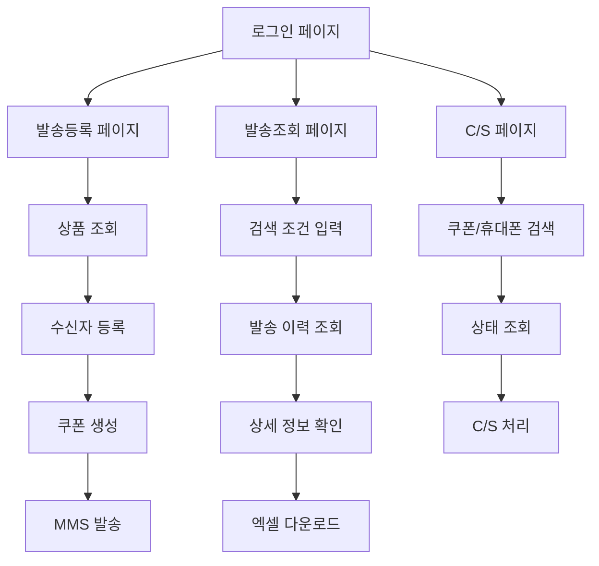

# 모바일 쿠폰 시스템 백엔드 요구사항 문서

## 1. Product Overview

모바일 쿠폰 시스템은 기업 고객이 COUFUN 쿠폰 공급처를 통해 쿠폰을 생성하고, LG유플러스 문자 서비스를 통해 고객에게 쿠폰을 발송할 수 있는 B2B 웹 애플리케이션입니다.

- 기업 고객사의 마케팅 담당자가 쿠폰 발송 캠페인을 관리하고, 발송 결과를 추적할 수 있는 통합 관리 시스템을 제공합니다.
- COUFUN API와 LG유플러스 UMS 시스템 연동을 통해 안정적이고 효율적인 쿠폰 발송 서비스를 구현합니다.

## 2. Core Features

### 2.1 User Roles

| Role | Registration Method | Core Permissions |
|------|---------------------|------------------|
| 관리자 | 시스템 관리자가 직접 등록 | 모든 기능 접근, 사용자 관리, 시스템 설정 |
| 일반 사용자 | 관리자 승인 후 계정 생성 | 쿠폰 발송, 조회, C/S 처리 기능 |

### 2.2 Feature Module

모바일 쿠폰 시스템 백엔드는 다음과 같은 주요 페이지들을 지원합니다:

1. **로그인 페이지**: 사용자 인증, 세션 관리, 보안 처리
2. **발송등록 페이지**: 상품 조회, 쿠폰 생성, MMS 발송, 수신자 관리
3. **발송조회 페이지**: 발송 이력 조회, 상세 정보 확인, 엑셀 다운로드
4. **C/S 페이지**: 쿠폰 상태 조회, 휴대폰 번호 변경, 재발송 처리

### 2.3 Page Details

| Page Name | Module Name | Feature description |
|-----------|-------------|---------------------|
| 로그인 페이지 | 사용자 인증 | 아이디/비밀번호 검증, JWT 토큰 생성, 세션 관리, 로그인 이력 기록 |
| 발송등록 페이지 | 상품 정보 조회 | COUFUN API 연동하여 상품 목록 조회, 상품 상세 정보 표시, 캐싱 처리 |
| 발송등록 페이지 | 쿠폰 생성 및 발송 | COUFUN 쿠폰 생성 API 호출, LG유플러스 UMS_MSG 테이블 연동, MMS 발송 처리 |
| 발송등록 페이지 | 수신자 관리 | 간편 등록(텍스트), 대량 등록(엑셀), 휴대폰 번호 유효성 검증 |
| 발송조회 페이지 | 발송 이력 조회 | 날짜별/고객사별/이벤트별 검색, 페이징 처리, 정렬 기능 |
| 발송조회 페이지 | 상세 정보 확인 | 개별 쿠폰 발송 상태 조회, 발송 결과 확인, 실패 사유 분석 |
| 발송조회 페이지 | 데이터 내보내기 | 엑셀 파일 생성, 쿠폰 번호 목록 다운로드 |
| C/S 페이지 | 쿠폰 상태 조회 | COUFUN 상태 조회 API 연동, 쿠폰 유효성 확인, 교환 상태 확인 |
| C/S 페이지 | 휴대폰 번호 변경 | 쿠폰 수신자 정보 수정, 변경 이력 관리, 재발송 처리 |
| C/S 페이지 | 쿠폰 취소 처리 | COUFUN 쿠폰 취소 API 연동, 취소 사유 기록, 환불 처리 |

## 3. Core Process

### 관리자 Flow
1. 시스템 관리자 로그인 → 사용자 관리 → 계정 생성/수정/삭제 → 권한 설정

### 일반 사용자 Flow
1. 사용자 로그인 → 발송등록 → 상품 선택 → 수신자 등록 → 쿠폰 생성 및 발송
2. 사용자 로그인 → 발송조회 → 검색 조건 설정 → 결과 확인 → 상세 정보 조회
3. 사용자 로그인 → C/S → 쿠폰 번호/휴대폰 번호 입력 → 상태 확인 → 처리 작업 수행

## 4. 외부 시스템 연동 요구사항

### 4.1 COUFUN 쿠폰 공급사 연동

#### 4.1.1 연동 목적
- 쿠폰 상품 정보 조회 및 관리
- 실시간 쿠폰 생성 및 발급
- 쿠폰 상태 조회 및 취소 처리
- 교환 정보 실시간 수신

#### 4.1.2 필수 연동 API
| API명 | 용도 | 호출 시점 | 통신방식 | 응답형식 |
|-------|------|-----------|----------|----------|
| 상품정보 연동 (coufunProduct.do) | 발송 가능한 쿠폰 상품 목록 | 발송 등록 시 | HTTP GET/POST | XML |
| 쿠폰생성 (coufunCreate.do) | 실제 쿠폰 발급 (최대 10개) | 발송 실행 시 | HTTP POST | XML |
| 쿠폰상태조회 (coufunPartAmountStatus.do) | 쿠폰 사용/잔액 확인 | C/S 문의 시 | HTTP POST | XML |
| 쿠폰취소 (coufunPartCancel.do) | 쿠폰 무효화 처리 | 취소 요청 시 | HTTP POST | XML |
| 교환정보 수신 (Webhook) | 쿠폰 사용 내역 실시간 수신 | 실시간 수신 | HTTP POST | JSON |

#### 4.1.3 COUFUN API 상세 스펙

**상품정보 연동**
- URL: `https://corp.coufun.kr:446/b2c_api/coufunProduct.do` (상용)
- URL: `https://tcorp.coufun.kr:446/b2c_api/coufunProduct.do` (테스트)
- 필수 파라미터: POC_ID (고객사 ID, 10byte)
- 응답 데이터: GOODS_ID, GOODS_NAME, GOODS_PRICE, IMAGE_PATH 등

**쿠폰생성**
- URL: `https://corp.coufun.kr:446/b2c_api/coufunCreate.do`
- 필수 파라미터: POC_ID, GOODS_ID, CREATE_CNT (최대 10개)
- 선택 파라미터: TR_ID (고객사 고유 ID, 50byte)
- 응답 데이터: ORDER_ID, BARCODE_NUM, VALID_END_DATE

**쿠폰상태조회**
- URL: `https://corp.coufun.kr:446/b2c_api/coufunPartAmountStatus.do`
- 필수 파라미터: POC_ID, GOODS_ID, BARCODE_NUM
- 응답 데이터: COUPON_TYPE (BARCODE/AMOUNT), STATUS (000/001/100), REMAIN_AMOUNT

**교환정보 Webhook**
- 수신 파라미터: BARCODE_NUM, STATUS, EXCHANGE_DATE, BRANCH_NAME, PRICE, BALANCE
- 응답 필수: RESULTCODE (00:성공), RESULTMSG, EXCHANGE_ID
- 재시도: '00' 코드 미수신 시 10분 간격 재시도

#### 4.1.3 연동 데이터 관리
- **POC_ID**: COUFUN에서 발급받은 클라이언트 식별자
- **TR_ID**: 거래 고유 번호 (시스템 내 tr_id와 동일)
- **GOODS_ID**: 상품 식별자
- **BARCODE_NUM**: 쿠폰 바코드 번호
- **응답 데이터**: XML 형태로 수신하여 JSON 변환 후 저장

#### 4.1.4 에러 처리 요구사항
- COUFUN API 호출 실패 시 재시도 로직 (최대 3회)
- 타임아웃 설정 (30초)
- 에러 코드별 사용자 친화적 메시지 표시
- 실패한 쿠폰 생성 요청에 대한 별도 관리

### 4.2 LG유플러스 UMS 시스템 연동

#### 4.2.1 연동 목적
- MMS를 통한 쿠폰 이미지 발송
- 발송 결과 실시간 확인
- 대량 발송 처리
- 발송 실패 시 재발송 관리

#### 4.2.2 UMS_MSG 테이블 연동 상세 스펙

**테이블 구조 및 필수 컬럼**
- **CLIENT_KEY**: 메시지 고유 번호 (40byte, 우리 tr_id 사용)
- **REQ_CH**: 발송 채널 (MMS 고정)
- **TRAFFIC_TYPE**: 메시지 유형 (normal/real/batch)
- **MSG_STATUS**: 발송 상태 (ready로 INSERT)
- **CALLBACK_NUMBER**: 발신번호 (16byte)
- **PHONE**: 수신번호 (16byte)
- **MSG**: 메시지 내용 (2000byte)
- **TITLE**: 제목 (100byte)
- **MMS_FILE_LIST**: MMS 파일 경로 (최대 3개, 쉼표 구분)

**발송 방식**
- UMS_MSG 테이블에 INSERT하여 발송 요청
- SNAP 에이전트가 자동으로 테이블 생성 및 관리
- 이미지 파일: 절대경로/URL/File ID 지원 (300KB 이하)

#### 4.2.3 발송 결과 확인 상세

**결과 확인 테이블**
- **UMS_LOG_YYYYMM**: 월별 파티션 테이블에서 결과 조회
- **발송 완료 후 자동 이관**: msg_status가 complete로 변경 후 이관

**주요 결과 컬럼**
- **DONE_CODE**: 처리 결과 코드 (00000:성공)
- **DONE_PRODUCT**: 발송 성공 상품 (MMS)
- **DONE_DATE**: 단말 전달 시간
- **DONE_TELCO**: 이통사 코드 (SKT/KTF/LGU)
- **DONE_FB_DETAIL**: 실패 시 상세 정보 (JSON 형태)

**결과 코드 분류**
- **성공**: 00000
- **MMS 관련**: 41000번대 (41010:파일미존재, 41020:확장자오류, 41030:용량초과)
- **SMS 관련**: 42000번대 (42020:번호형식오류, 42030:발신번호미등록)
- **시스템 오류**: 90000번대 (에이전트 자체 실패)

#### 4.2.4 이미지 생성 요구사항
- **템플릿 기반**: 선택된 템플릿에 쿠폰 정보 삽입
- **동적 생성**: 발송 시점에 실시간 이미지 생성
- **파일 관리**: 생성된 이미지 파일의 임시 저장 및 정리
- **품질 관리**: 해상도 및 파일 크기 최적화

### 4.3 MySQL 데이터베이스 연동

#### 4.3.1 연결 정보
- **메인 DB 호스트**: 192.168.0.113:3306
- **UMS DB 호스트**: 192.168.0.113:3306 (LG유플러스 UMS 연동용)
- **데이터베이스**: 
  - coupon_mgmt (개발/운영)
  - coupon_mgmt_test (테스트 전용)
- **사용자**: coupon/coupon
- **문자셋**: utf8mb4
- **타임존**: Asia/Seoul

#### 4.3.2 데이터베이스 관리
- **연결 풀**: 최소 5개, 최대 20개 연결 유지
- **백업**: 일일 자동 백업 (binlog 포함)
- **모니터링**: 성능 및 용량 모니터링
- **인덱스 관리**: 쿼리 성능 최적화
- **파티셔닝**: 대용량 테이블 월별 파티셔닝 (UMS_LOG_YYYYMM 방식)

#### 4.3.3 데이터 암호화
- **개인정보**: AES-256 암호화 저장
- **암호화 대상**: 휴대폰번호, 이름, 이메일, 주소
- **키 관리**: 환경변수로 암호화 키 관리 (ENCRYPTION_KEY)
- **복호화**: 조회 시 자동 복호화
- **마스킹**: 로그 출력 시 개인정보 마스킹 처리

## 5. User Interface Design

### 5.1 Design Style

- **Primary Color**: #007bff (Bootstrap Primary Blue)
- **Secondary Color**: #6c757d (Bootstrap Secondary Gray)
- **Button Style**: Bootstrap 5 기반 rounded 버튼, hover 효과 적용
- **Font**: 시스템 기본 폰트, 한글 지원을 위한 Noto Sans KR 적용
- **Layout Style**: Bootstrap 5 Grid 시스템 기반, 카드형 레이아웃, 상단 네비게이션
- **Icon Style**: Font Awesome 6.5.2 아이콘 세트 사용

### 5.2 Page Design Overview

| Page Name | Module Name | UI Elements |
|-----------|-------------|-------------|
| 로그인 페이지 | 인증 폼 | 중앙 정렬 카드 레이아웃, 파란색 로그인 버튼, 페이드인 애니메이션 효과 |
| 발송등록 페이지 | 정보 입력 폼 | 다단계 카드 레이아웃, 필수 입력 필드 표시, 실시간 유효성 검증 |
| 발송등록 페이지 | MMS 미리보기 | 우측 고정 영역, 이미지 미리보기, 반응형 디자인 |
| 발송조회 페이지 | 검색 및 결과 | 상단 검색 카드, 하단 테이블 형태, 정렬 가능한 헤더, 페이징 |
| C/S 페이지 | 조회 및 처리 | 간단한 검색 폼, 결과 테이블, 액션 버튼, 모달 다이얼로그 |

### 5.3 Responsiveness

- **Desktop-first 설계**: 주 사용자가 업무용 데스크톱 환경
- **Mobile-adaptive**: 태블릿 및 모바일에서도 기본 기능 사용 가능
- **Touch interaction**: 모바일에서 터치 친화적인 버튼 크기 및 간격 적용

## 6. 보안 및 성능 요구사항

### 6.1 보안 요구사항
- **인증**: JWT 토큰 기반 인증 (24시간 만료)
- **권한**: 역할 기반 접근 제어 (RBAC) - 관리자/일반사용자
- **암호화**: 개인정보 AES-256 암호화 (휴대폰번호, 이름, 이메일)
- **API 보안**: COUFUN POC_ID 검증, LG유플러스 CLIENT_KEY 관리
- **로깅**: 모든 API 호출 및 데이터 변경 로그 (개인정보 마스킹)
- **입력 검증**: SQL Injection, XSS 방어, 파라미터 길이 제한
- **네트워크**: HTTPS 통신 강제, 내부 DB 접근 제한

### 6.2 성능 요구사항
- **API 응답 시간**: 
  - 일반 조회: 1초 이내
  - COUFUN API 호출: 5초 이내
  - MMS 발송: 3초 이내 (UMS_MSG INSERT)
- **동시 처리**: 최대 100명 동시 접속
- **배치 처리**: 
  - 쿠폰 생성: 1회 최대 10개 (COUFUN 제한)
  - MMS 발송: 1회 최대 1,000건
- **가용성**: 99.5% 이상 서비스 가용성
- **데이터베이스**: 연결 풀 최적화, 인덱스 활용
- **캐싱**: Redis 활용한 세션 및 임시 데이터 캐싱

### 6.3 모니터링 및 알림
- **시스템 모니터링**: CPU, 메모리, 디스크 사용률
- **API 모니터링**: 응답시간, 에러율, TPS
- **외부 연동 모니터링**: COUFUN/LG유플러스 API 상태
- **알림 설정**: 시스템 장애, API 에러 시 즉시 알림
- **로그 관리**: 일별 로그 파일 생성, 30일 보관

## 7. 에러 처리 및 로깅 요구사항

### 7.1 에러 처리

#### 7.1.1 사용자 에러
- **입력 검증 실패**: 필드별 상세 에러 메시지
- **권한 부족**: 명확한 권한 안내 메시지
- **중복 요청**: 중복 방지 및 안내 메시지
- **파일 업로드 실패**: 파일 형식/크기 제한 안내

#### 7.1.2 시스템 에러
- **데이터베이스 연결 실패**: 자동 재시도 및 알림
- **외부 API 호출 실패**: 재시도 로직 및 대체 방안
- **서버 오류**: 일반적인 에러 메시지 및 로그 기록
- **메모리 부족**: 자동 정리 및 알림

#### 7.1.3 외부 연동 에러
- **COUFUN API 에러**: 에러 코드별 처리 방안
- **LG유플러스 발송 실패**: 재발송 로직
- **이미지 생성 실패**: 대체 템플릿 사용
- **네트워크 타임아웃**: 재시도 및 사용자 안내

### 7.2 로깅 요구사항

#### 7.2.1 로그 레벨
- **ERROR**: 시스템 오류, 외부 API 실패
- **WARN**: 성능 저하, 비정상적 접근
- **INFO**: 주요 비즈니스 로직 실행
- **DEBUG**: 개발 시 상세 정보

#### 7.2.2 로그 내용
- **사용자 액션**: 로그인, 발송 요청, 조회 등
- **시스템 이벤트**: 서버 시작/종료, 스케줄 작업
- **외부 연동**: API 호출 및 응답 정보
- **성능 지표**: 응답 시간, 메모리 사용량

#### 7.2.3 로그 관리
- **파일 로테이션**: 일별 로그 파일 생성
- **보관 기간**: 30일간 보관 후 자동 삭제
- **로그 레벨 설정**: 환경별 로그 레벨 조정
- **모니터링 연동**: 에러 로그 실시간 알림